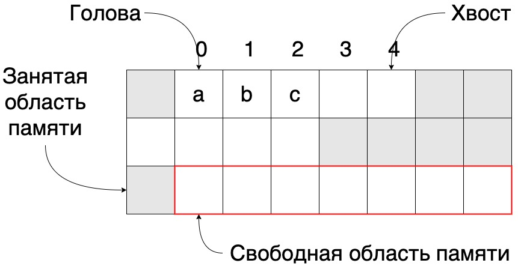

# Массивы



Массив - коллекция элементов одного типа, располагающихся непрерывно в памяти. Динамический массив может изменять свой
размер в зависимости от количества элементов в нём.

## Создание массива

Массив может хранить N элементов. Это значение определяется при создании, также можно указать типы хранимых объектов. На
основе количества элементов в памяти ищется и затем резервируется место в непрерывном адресном пространстве. Из-за этой
особенности хранения проход по массиву происходит быстрее, чем например по связанному списку, однако изначальная
инициализация памяти сложнее(особенно для больших массивов), ведь требуется подыскать свободное место без
"разрывов".

Динамический массив также изначально резервирует некий объем памяти. При полном ее заполнении происходит поиск нового
адресного пространства уже большего размера и копирование в него старого массива. И так далее. Это проиллюстрировано на
рисунке выше. Массив вместимостью в 5 элементов заполняется и затем выделяется память, очерченная красной рамкой.

Если при создании было установлено N элементов, система заранее зарезервирует нужное количество ячеек памяти и в
дальнейшем не будет накладных расходов по расширению адресного пространства и копированию туда старых элементов. Однако
важно понимать, что если выделить 10 000 ячеек и хранить данные только в 15 из них, остальные 9985 будут "простаивать".

При удалении элементов уменьшение размера массива никогда не происходит. В некоторых языках программирования для
принудительного изменения размера после удаления можно использовать определенные инструменты.

## Длина и вместимость массива

Основные характеристики массива - длина и вместимость.

**Длина** - это количество элементов, находящихся в данный момент в массиве.

**Вместимость** - это максимальное количество элементов, которое можно добавить в массив. Вместимость не может быть
изменена после создания для статических массивов.

Сразу после создания длина равна 0, а вместимость зависит от того, динамический ли массив или с указанием N элементов.
После полного заполнения массива вместимость станет равна длине.

Временная сложность получения длины последовательности - **O(1)**

## Доступ к элементу по индексу

Элементы массива пронумерованы, причем нумерация начинается с 0 до N - 1. Позиция элемента называется его индексом. В
большинстве языков программирования доступ по индексу производится с использованием квадратных скобок ``array[]``. Если
запросить доступ по индексу, где еще не был установлен элемент в Java вернется null если массив содержит объекты и
значения по умолчанию для примитивных типов. В С-подобных языках пустая ячейка может содержать полностью случайные
величины.

Временная сложность получения элемента по индексу - **O(1)**

## Присвоение значения по индексу

При вставке по индексу используются квадратные скобки ``array[3]=val``. Если в ячейке уже есть элемент, то он
перезаписывается. Эта самый быстрый тип вставки, так как не требует расширения памяти или дополнительных операций с
данными массива.

Отличие присвоения значения по индексу от вставки в том, что во втором случае требуется сдвиг некоторого количества
соседних элементов. В первом случае происходит простое замещение элемента. Например, вставка по индексу 1(см рис)
потребует смещение элементов ``b`` и ``с`` вправо. Но присвоение значения по индексу 1 просто заменит ``b`` на новый
элемент.

Временная сложность вставки элемента по индексу - **O(1)**

## Вставка элементов

Вставить элемент можно тремя путями - в середину, в "голову" и в "хвост".

Вставка в "хвост" не требует дополнительных операций с данными массива, все что нам нужно сделать — это присвоить новому
элементу индекс сразу после последнего элемента. Однако в случае полного заполнения массива происходит поиск новой
большей области памяти и копирование туда старых данных. Операция затратная, но по статистике редкая, поэтому не
учитывается при расчете временной сложности.

Вставка элемента в "голову" самая дорогая операция так как требует сдвига всех элементов массива на один индекс вправо,
чтобы освободить место для нового элемента. При этом также может понадобиться расширение области памяти.

Наконец вставка в середину подразумевает сдвиг всех правых элементов на одну позицию вправо и запись по индексу. По
факту это общий случай вставки в "голову" с такой же временной сложностью.

Временная сложность операций:

Вставка элемента в середину - **O(n)**

Вставка элемента в "голову" - **O(n)**

Вставка элемента в "хвост" - **O(1)**

## Удаление элементов

Удаление, подобно вставке, имеет 3 варианта: удаление из "головы", середины и "хвоста" списка.

Удаление элемента из "хвоста" имеет самое минимальное время среди трех сценариев. Мы всего лишь уменьшаем длину массива
на единицу. Таким образом сам элемент не удаляется и остается лежать в памяти, но добавление нового элемента в массив
просто заменит удаленный элемент, т.к. индекс вставляемого элемента вычисляется на основе длины.

Удаление элемента из "головы" требует смещение всех правых элементов на одну позицию влево. Если всего элементов N, то
потребуется произвести N сдвигов. Как в случае со вставкой - это самая дорогая операция.

Удаление из середины - частный случай удаления из "головы". Требует сдвига в лево К правых элементов. В худшем
случае ``К=N`` поэтому временная сложность этой операции равна сложности удаления элемента из "головы".

Временная сложность операций:

Удаление элемента из "головы" - **O(n)**

Удаление элемента из середины - **O(n)**

Удаление элемента из "хвоста" - **O(1)**

## Линейный поиск по массиву

Поиск по массиву означает нахождение индекса элемента по его значению. Если элемент не найден, то возвратить ``-1``.

Линейный поиск - это последовательный перебор каждого элемента массива, начиная с нулевого индекса. Если искомый элемент
найден, то следует возвратить его индекс. В худшем случае, если элемента нет в массиве, мы переберем все N объектов и
вернем ``-1``. Следовательно, временная сложность линейного поиска равна **O(n)**. При реализации линейного поиска
следует учесть крайние случаи - массив пуст, т.е. его длина равна нулю или элемент не присутствует в массиве.

Линейный поиск по списку - **O(n)**

## Операции над исходным массивом

Под операциями над исходным массивом понимают шаги алгоритмов, не требующих выделение новой памяти, т.е. действия
производятся с текущим массивом. Данные алгоритмы следует применять для уменьшения пространственной сложности. Например,
удаление элемента из "головы" не требует дополнительного выделения памяти или создания новых переменных. Все действия
выполняются на исходных данных.

## Матрицы

Матрицу можно рассматривать как двумерный массив. Самый простой способ ее реализации - это массив с М строк, каждая
позиция которого содержит другой массив с N колонок. В таком случае доступ к ячейке можно получить по индексам следующим
образом ``A[i][j]``.

В С++ матрица хранится в виде одномерного массива, который хранит ``M * N`` элементов.

При таком способе хранения доступ к ячейке можно получить по индексу следующим образом ``A[i * N + j]``.

## Строки

Строка - это массив unicode символов. Это значит, что строки поддерживают такие же операции, как и массивы с аналогичной
временной сложностью. Например, поиск подстроки или символа занимает **O(n)**. 

В большинстве языков программирования они неизменяемы, т.е. создав один раз строку, изменить ее не получится. Однако в
С++ строки изменяемы. Выполнив

```
#include <iostream>

int main() {
    string s1 = "Hello World";
    s1[5] = ',';
    cout << s1 << endl;
}
```

результат будет ``Hello,World``.

Конкатенация двух строк длиной M и N в ЯП, где строки являются неизменяемыми объектами потребует выделение новой памяти
размером ``M+N``, копирования туда строки M и вставки строки N. Из-за этого такие ЯП имеют специальные инструменты для
быстрой конкатенации. В Java - это ``StringBuilder``, в python ``'.'.join(['ab', 'pq', 'rs']) -> 'ab.pq.rs'``.