# Обход графа в ширину

Существует два основных алгоритма обхода графов. Рассмотрим один из них.

**Breadth First Search (BFS)** - это алгоритм последовательного обхода вершин графа по уровням k, то есть перед тем как
приступить к поиску вершин на расстоянии k+1 от заданной вершины, выполняется обход всех вершин на расстоянии k. Метод
не учитывает иерархию структуры данных, а лишь глубину уровней. Одним из наиболее частых случаев применения BFS можно
назвать поиск кратчайшего расстояния от заданной вершины до искомой.

Для обхода графа в ширину используется несколько техник, например с использованием очереди или метод сохранения вершин.
Рассмотрим более детально алгоритм с использованием очереди. Дан граф G(V, E), требуется обойти все его вершины V.

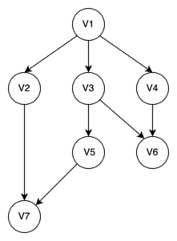

Цветовая гамма: зеленый — вершина в обработке, серый — вершина найдена, но ждет своей обработки, красный — вершина
исключена из очереди.

1. Кладем заданную вершину V1 в очередь Q.

   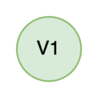

1. Находим все дочерние вершины V1: V2, V3, V4. Кладем найденные вершины в очередь и помечаем V1 как обработанную, т.е.
   исключаем ее из очереди.

   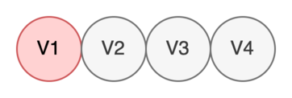

1. Берем в работу V2.

   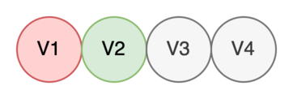

1. Находим все дочерние вершины V2: V7. Кладем найденные вершины в очередь и помечаем V2 как обработанную.

   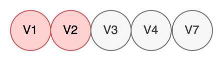

1. Берем в работу V3.

   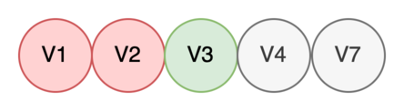

1. Находим все дочерние вершины V3: V5, V6. Кладем найденные вершины в очередь и помечаем V3 как обработанную.

   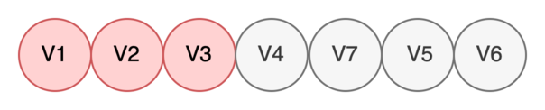

1. Берем в работу V4.

   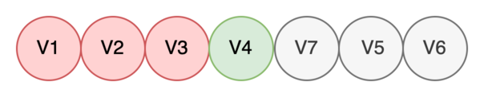

1. Находим все дочерние вершины V4: V6. Видим, что найденная вершина V6 уже определена, поэтому просто помечаем V4 как
   обработанную.

   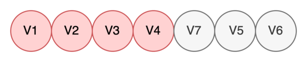

1. Берем в работу V7.

   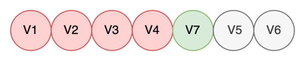

1. Дочерних вершин у нее нет, поэтому в очередь класть нечего. Сразу помечаем V7 как обработанную.

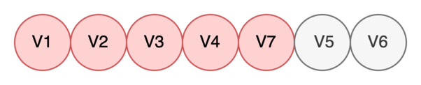

1. Берем в работу V5.

   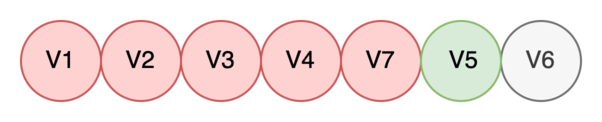

1. Находим все дочерние вершины V5: V7. Видим, что найденная вершина V7 уже определена, поэтому просто помечаем V5 как
   обработанную.

   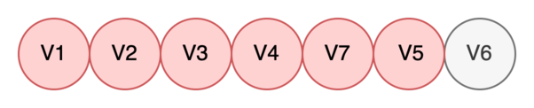

1. Берем в работу V6. Дочерних вершин у нее нет, поэтому в очередь класть нечего. Сразу помечаем V6 как обработанную.

   

1. Видим, что очередь пустая, поэтому больше брать в работу нечего. Мы обошли весь граф. Завершаем алгоритм.

   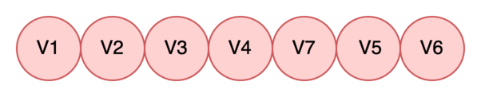

Теперь, изучив алгоритм боле детально, напишем его реализацию на python. Здесь класс ``Node`` описывает вершину графа,
функция ``bfs`` производит обход графа в ширину, а функция ``bfs_2`` является модификацией ``bfs``. В процессе ее работы
мы не посещаем уже обработанные вершины.

```python
from collections import deque
from typing import Optional, List, Tuple, Hashable


class Node:
    def __init__(self, data: int, children: Optional[List['Node']] = None):
        self.data = data
        self.children = children

    def __repr__(self):
        return str(self.data)

    def __hash__(self):
        return hash(self.data)

    def __eq__(self, other):
        return self.data == other.data


def test_bfs():
    graph = Node(1, [
        Node(2, [Node(7)]),
        Node(3, [
            Node(5, [Node(7)]),
            Node(6),
        ]),
        Node(4, [Node(6)]),
    ])
    print('\n')

    print(isinstance(Node(6), Hashable))

    print(hash(Node(6)))

    step, node = bfs_2(graph, 6)
    assert 2 == step
    assert node.data == 6

    step, node = bfs_2(graph, 7)
    assert 2 == step
    assert node.data == 7


def bfs(root: Node, target: int) -> Tuple[int, Optional[Node]]:
    """
    Обход графа в ширину с поиском значения атрибута Node.data
    :param root: Начальная вершина графа.
    :param target: искомое значение
    :return: (step, node) - кратчайший путь между вершинами, найденная вершина. Если не найдено, None
    """
    queue = deque()  # хранение всех вершин, которые ожидают обработки
    step = 0  # количество необходимых шагов, чтобы достичь искомую вершину
    # инициализация
    queue.append(root)
    while len(queue) > 0:  # пока очередь не пуста
        print(f'============== Step: {step} ==============')
        size = len(queue)
        # обработка элементов, которые находятся в очереди, те вершин одного уровня
        for _ in range(size):
            current_node = queue.popleft()
            print(f'Node: {current_node}')
            if current_node.data == target:
                return step, current_node
            if current_node.children:
                for child in current_node.children:
                    queue.append(child)
        step += 1

    return step, None  # вершина не найдена


def bfs_2(root: Node, target: int) -> Tuple[int, Optional[Node]]:
    """
    Обход графа в ширину без посещения уже обработанных вершин с поиском значения атрибута Node.data
    :param root: Начальная вершина графа.
    :param target: искомое значение
    :return: (step, node) - кратчайший путь между вершинами, найденная вершина. Если не найдено, None
    """
    queue = deque()  # хранение всех вершин, которые ожидают обработки
    visited = set()  # вершины, которые уже посетили
    step = 0  # количество необходимых шагов, чтобы достичь искомую вершину
    # инициализация
    queue.append(root)
    visited.add(root)
    while len(queue) > 0:  # пока очередь не пуста
        print(f'============== Step: {step} ==============')
        size = len(queue)
        # обработка элементов, которые находятся в очереди, те вершин одного уровня
        for _ in range(size):
            current_node = queue.popleft()
            print(f'Node: {current_node}')
            if current_node.data == target:
                return step, current_node
            if current_node.children:
                for child in current_node.children:
                    if child not in visited:
                        queue.append(child)
                        visited.add(child)
        step += 1

    return step, None  # вершина не найдена
```

**Пространственная сложность**
Так как в памяти хранятся все развёрнутые узлы, пространственная сложность алгоритма составляет ``O(V+E)``.

**Временная сложность**
Так как в худшем случае алгоритм посещает все узлы графа, временная сложность алгоритма составляет ``O(V+E)``.