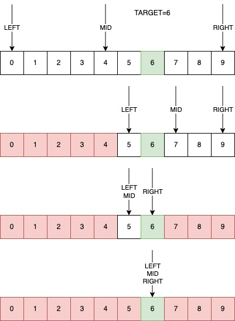
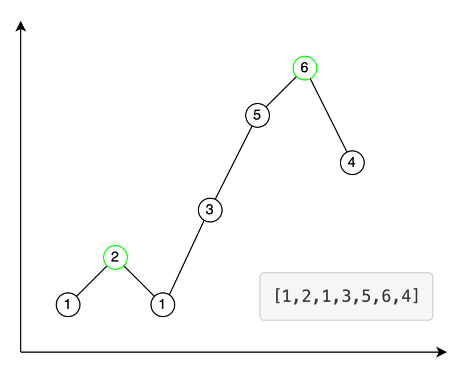

# Бинарный поиск

Бинарный поиск — процесс нахождения индекса элемента с целевым значением в **отсортированном** массиве путем его
дробления на половину на каждом шаге новой итерации. Изначально алгоритм поиска сравнивает искомое значение со средним
элементом в массиве. Если значения не равны, то он отбрасывает ту часть массива, в которой целевое значение
гарантированно не может находиться. Далее поиск продолжается в оставшейся части элементов путем сравнения средних
элементов с искомым значением до тех пор, пока оно не будет найдено, либо пока оставшаяся часть не станет пустой. В этом
случае мы можем сказать, что элемент не найден.

Бинарный поиск имеет логарифмическую временную сложность **O(logN)** и постоянную пространственную сложность по
памяти **O(1)**. На больших массивах бинарный поиск работает быстрее линейного поиска, однако список изначально должен
быть отсортирован.

Терминология, используемая в бинарном поиске:

1. target - значение, которое требуется найти
2. index - индекс значения, которое требуется найти
3. left, right - левый и правый индексы, которые определяют область поиска
4. mid - индекс среднего элемента в текущей области поиска, который мы будем сравнивать с целевым значением

Наглядное представление алгоритма поиска следующее:



Самую простую и понятную реализацию поиска числа в массиве можно представить так:

```python
def binary_search(arr: list[int], target: int) -> int:
    """
    Двоичный (бинарный) поиск (дихотомия)
    :param arr: массив для поиска.
    :param target: элемент, который нужно найти.
    :return: индекс элемента или -1 если не найдено
    """
    left = 0
    right = len(arr) - 1
    while left <= right:
        mid = (left + right) // 2
        middle = arr[mid]
        if middle < target:
            left = mid + 1
        elif middle > target:
            right = mid - 1
        else:
            return mid
    return -1
```

Здесь мы постепенно сужаем область поиска, используя условие сравнения ``middle`` с ``target``. После цикла while нет
дополнительной постобработки, мы просто возвращаем -1, элемент не найден.

**Продвинутый бинарный поиск**

Иногда полезны другие вариации бинарного поиска, где используется условие сравнения ``middle`` с его соседями. Например
задача нахождения любого локального максимума в последовательности. Локальный максимум — это элемент, который всегда
больше своих соседей. Следовательно, если ``middle`` меньше либо равен, чем следующий элемент, мы двигаем левую границу,
в противном случае правую.

Допустим нам нужно найти локальный максимум в последовательности ``[1,2,1,3,5,6,4]``. Это числа 2 и 6. Наглядно это
выглядит так.



На начальном шаге число 3 сравнивается с 5. Двигаем левую границу к 3, т.к 3 меньше 5. Далее сравниваем 6 и 4. 6 больше
— двигаем правую к 6. На последнем шаге сравниваем 5 и 6. 5 меньше — устанавливаем левую границу на 6 и выходим из
цикла, т.к. правая и левая границы совпадают. Возвращаем левую границу, т.к. в последовательности всегда найдется
максимум. Пример кода следующий:

```python
def find_max_element(nums: list[int]) -> int:
    """
    Нахождение локального максимума
    :param nums: последовательность чисел
    :return: индекс максимума
    """
    if len(nums) == 1:
        return 0

    left, right = 0, len(nums) - 1

    if len(nums) == 2 and nums[left] < nums[right]:
        return right

    while left < right:
        mid = (left + right) // 2
        if nums[mid] > nums[mid + 1]:
            right = mid
        else:
            left = mid + 1

    return left
```

**Левый бинарный поиск** — это задача нахождения первого подходящего значения на интервале, где функция сначала
принимает значение ``0``, а затем ``1``.


Ниже представлена реализация левого бинарного поиска:

```python
def left_binary_search(left: int, right: int, check, *args) -> int:
    """
    Левый бинарный поиск. Задача нахождения первого подходящего значения
    ___плохо___|---хорошо---
    :param left: указатель на минимальное значение функции
    :param right: указатель на максимальное значение функции
    :param check: функция проверки условия
    :param args: аргументы функции проверки условия
    :return: индекс первого элемента, удовлетворяющего условию
    """
    while left < right:
        mid = (left + right) // 2
        if check(mid, *args):
            right = mid
        else:
            left = mid + 1

    return left
```

Рассмотрим пример поиска числа 6 ниже. Заметим, что

1. Функция бинарного поиска возвращает индекс найденного элемента
1. В случае, если мы ищем число, выходящее за правую границу области поиска, результатом работы будет индекс самого
   правого элемента. Например в задаче нахождения числа 13, вернется индекс числа 10
1. В случае, если мы ищем число, выходящее за левую границу области поиска, результатом работы будет индекс самого
   левого элемента. Например в задаче нахождения числа -2, вернется индекс числа 0

```python
def test_left_binary_search():
    # Определяем интервал поиска
    arr = [0, 0, 0, 0, 1, 2, 3, 4, 5, 6, 7, 8, 9, 10]
    # Определяем границы нашей функции
    left = 0
    right = len(arr) - 1
    # Искомое число
    target = 6

    def find_target(mid):
        return arr[mid] >= target

    assert 9 == left_binary_search(left, right, find_target)
```

**Правый бинарный поиск** — это задача нахождения последнего подходящего значения на интервале, где функция сначала
принимает значение ``1``, а затем ``0``.


Ниже представлена реализация правого бинарного поиска:

```python
def right_binary_search(left: int, right: int, check, *args) -> int:
    """
    Правый бинарный поиск. Задача нахождения последнего подходящего значения
    ---хорошо---|___плохо___
    :param left: указатель на минимальное значение функции
    :param right: указатель на максимальное значение функции
    :param check: функция проверки условия
    :param args: аргументы функции проверки условия
    :return: индекс последнего элемента, удовлетворяющего условию
    """
    while left < right:
        mid = (left + right + 1) // 2
        if check(mid, *args):
            left = mid
        else:
            right = mid - 1

    return left
```

Используя правый бинарный поиск в задаче нахождения числа 6, следует лишь поменять условие в функции проверки:

```python
def test_right_binary_search():
    # Определяем интервал поиска
    arr = [0, 0, 0, 0, 1, 2, 3, 4, 5, 6, 7, 8, 9, 10]
    # Определяем границы нашей функции
    left = 0
    right = len(arr) - 1
    # Искомое число
    target = 6

    def find_target(mid):
        return arr[mid] <= target

    assert 9 == right_binary_search(left, right, find_target)
```

Используя комбинацию левого и правого поисков можно решить задачу нахождения интервала в отсортированной неубывающей
последовательности. Например, так:

```python
def search_range(nums: List[int], target: int) -> List[int]:
    if len(nums) == 0:
        return [-1, -1]

    left, right = 0, len(nums) - 1

    def find_left_target(mid):
        return nums[mid] >= target

    def find_right_target(mid):
        return nums[mid] <= target

    left_idx = left_binary_search(left, right, find_left_target)

    if nums[left_idx] != target:
        left_idx = -1

    right_idx = right_binary_search(left, right, find_right_target)

    if nums[right_idx] != target:
        right_idx = -1

    return [left_idx, right_idx]


def test_search_range():
    nums = [5, 7, 7, 8, 8, 10]
    assert search_range(nums, 8) == [3, 4]
```