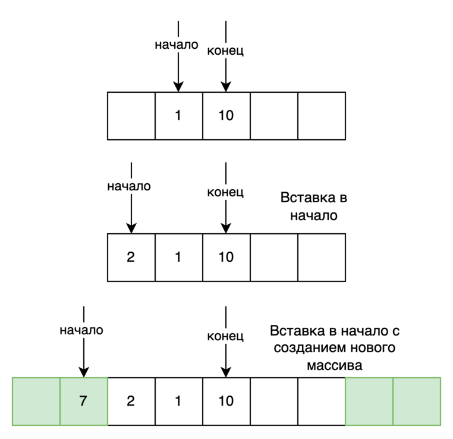
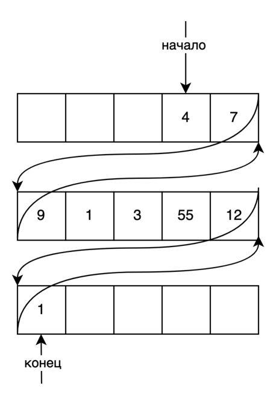

## Двусторонняя очередь

**Двусторонняя очередь** - абстрактный тип данных, в котором элементы можно добавлять и удалять как в начало, так и в
конец. В python есть реализация двусторонней очереди "deque", которая является обобщением очереди и стека. Данная
структура поддерживает эффективное извлечение элемента из любого конца за **O(1)**. Доступ к первому и последнему
элементу осуществляется также за **O(1)**, но имеет временную сложность за **O(n)** для доступа к произвольному
элементу.

Ниже приведена временная сложность операций для двусторонней очереди:

1. Добавление нового элемента справа/слева - **O(1)**.
2. Удаление элемента справа/слева - **O(1)**.
3. Расширение на m элементов справа/слева - **O(m)**.
4. Вставка нового элемента в произвольную позицию - **O(n)**.
5. Удаление элемента с заданным значением - **O(n)**.

## Реализация на базе массива

При использовании динамического массива в качестве основы при реализации двусторонней очереди мы свободно можем
добавлять и удалять элементы из хвоста. Эти операции выполняются за константное время. Однако массив не предназначен для
вставки и удаления из начала. Поэтому мы заранее создаем массив на определенное количество элементов и начинаем его
заполнение из середины. При достижении левой границы нам следует создать новый массив большего размера и скопировать
туда все элементы в середину. Перевыделение памяти и копирование туда старых значений ухудшает стабильность
производительности операций вставки в оба конца. Поэтому в данном случае мы можем говорить только об амортизационной
сложности операций.



## Реализация на базе двусвязного списка

Двустороннюю очередь очень просто и понятно реализовать на базе двусвязного списка. Основным минусом данного подхода
является медленная операция выделения памяти для нового элемента. При работе с указателями также используется
дополнительная память. Поэтому при хранении простых элементов(например, bool), перерасход может составить 200 и даже 300
процентов.

## Реализация с использованием блоков



Идея реализации двусторонней очереди с использованием блоков объединяет оба подхода, описанных в предыдущих двух
пунктах. В CPython структура deque представлена в виде статических массивов фиксированной длины размера 64, объединенных
в двусвязный список. Это ускоряет доступ к отдельным элементам очереди по индексу и гарантирует, что удаляемый или
извлекаемый элемент не затрагивает другие блоки данных. Другим преимуществом является то, что такое хранение позволяет
полностью отказаться от функции realloc(), которая изменяет размер выделенного блока памяти, что приводит к более
предсказуемой производительности. Использование блоков значительно снижает потребление памяти по сравнению с
классическим двусвязным списком, где на одну ячейку данных приходятся две указателя на следующий и предыдущий элементы.
В добавок к этому, статические массивы увеличивают вероятность использования кэша центрального процессора для уменьшения
среднего времени доступа к компьютерной памяти.

Список блоков никогда не бывает пустым, поэтому ``d.leftblock``(самый левый блок) и ``d.rightblock``(самый правый блок)
никогда не равны NULL. Первый элемент очереди определяется как ``d.leftblock[leftindex]``, а последний
как ``d.rightblock[rightindex]``.

Индексы ``d.leftindex`` и ``d.rightindex`` всегда находятся в диапазоне ``0 <= index < BLOCKLEN``, по умолчанию BLOCKLEN
равен 64.

Для поддержания симметричности операций вставки слева и справа точная взаимосвязь индексов такова:

```
(d.leftindex + d.len - 1) % BLOCKLEN == d.rightindex
```

Всякий раз, когда левый и правый блоки указывают на один и тот же массив (``d.leftblock == d.rightblock``), взаимосвязь
становится следующей:

```
d.leftindex + d.len - 1 == d.rightindex
```

Однако, когда блоков более одного, ``d.leftindex`` и ``d.rightindex`` являются индексами в разных массивах. В этом
случае любой из указателей может быть больше другого.

Для пустой очереди справедливо (CENTER равен ``((BLOCKLEN - 1) / 2)``):

1. ``d.len == 0``, длина очереди равна нулю
1. ``d.leftblock == d.rightblock``, левый и правый блоки указывают на один и тот же массив
1. ``d.leftindex == CENTER + 1``, левый индекс располагается в позиции 32
1. ``d.rightindex == CENTER``, правый индекс равен 31

Ниже представлены основные структуры двусторонней очереди на CPython:

```
#define BLOCKLEN 64
#define CENTER ((BLOCKLEN - 1) / 2)

typedef struct BLOCK {
    struct BLOCK *leftlink;
    PyObject *data[BLOCKLEN];
    struct BLOCK *rightlink;
} block;

typedef struct {
    PyObject_VAR_HEAD
    block *leftblock;
    block *rightblock;
    Py_ssize_t leftindex;       /* 0 <= leftindex < BLOCKLEN */
    Py_ssize_t rightindex;      /* 0 <= rightindex < BLOCKLEN */
    size_t state;               /* incremented whenever the indices move */
    Py_ssize_t maxlen;          /* maxlen is -1 for unbounded deques */
    Py_ssize_t numfreeblocks;
    block *freeblocks[MAXFREEBLOCKS];
    PyObject *weakreflist;
} dequeobject;
```