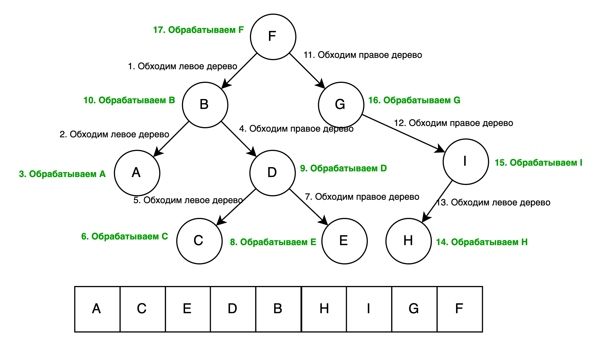

# Обход графа глубину

**Depth first search (DFS)** - поиск в глубину, способ обхода или нахождения узлов в графах и деревьях. Аналогично
поиску в ширину(``BFS``) алгоритм ``DFS`` также обходит каждый узел структуры, однако в случае поиска в глубину
учитывается иерархия хранения данных. Другими словами, поиск в ширину не осуществляет переход на следующий, более
глубокий уровень до тех пор, пока не будут обработаны все узлы текущего уровня. Напротив, при реализации поиска в
глубину алгоритм не выполняет переход к следующему узлу текущего уровня, пока не достигнет самого конечного элемента
поддерева обрабатываемого элемента. Также следует заметить, что поиск в глубину ищет не самый короткий, а случайный
путь.

## Стек и DFS

Обычно, алгоритм DFS реализуют при помощи стека и рекурсии. Шаблон реализации DFS с использованием стека и рекурсии
представлен ниже:

```python
from typing import Optional, List, Set


class Node:
    """
    Graph node
    """

    def __init__(self, data: int, children: Optional[List['Node']] = None):
        self.data = data
        self.children = children

    def __repr__(self):
        return str(self.data)

    def __hash__(self):
        return hash(self.data)

    def __eq__(self, other):
        return self.data == other.data


def dfs(current: Node, target: int, visited: Set[Node]) -> Optional[Node]:
    """
    Обход графа в глубину с поиском значения атрибута Node.data
    :param current: Начальная вершина графа.
    :param target: искомое значение
    :param visited: посещенные вершины
    :return: node - найденная вершина. Если не найдено, None
    """
    if current.data == target:
        return current

    if current.children:
        for child in current.children:
            if child not in visited:
                visited.add(child)
                node = dfs(child, target, visited)
                if node:
                    return node

    return None  # вершина не найдена
```

Может показаться, что мы не используем стек в данной реализации, однако здесь неявно применяется системный стек
вызовов (call stack) - стек, хранящий информацию для возврата управления из функций в программу. Текущий размер стека
равен глубине обхода, поэтому в худшем случае **пространственная сложность** обхода составит **O(h)**, где h -
максимальная глубина графа или дерева. В случае очень большой глубины графа, при использовании шаблона выше может
произойти переполнение системного стека вызова, и произойдет ошибка ``stack overflow``. Чтобы этого избежать, следует
явно использовать стек в реализации:

```python
from typing import Optional, List


class Node:
    """
    Graph node
    """

    def __init__(self, data: int, children: Optional[List['Node']] = None):
        self.data = data
        self.children = children

    def __repr__(self):
        return str(self.data)

    def __hash__(self):
        return hash(self.data)

    def __eq__(self, other):
        return self.data == other.data


def dfs(root: Node, target: int) -> Optional[Node]:
    """
    Обход графа в глубину с поиском значения атрибута Node.data
    :param root: Начальная вершина графа.
    :param target: искомое значение
    :return: node - найденная вершина. Если не найдено, None
    """
    visited = set()  # посещенные вершины
    stack = [root]
    while len(stack) > 0:  # пока стек не пуст
        current = stack.pop()

        if current.data == target:
            return current

        if current.children:
            for child in current.children:
                if child not in visited:
                    visited.add(child)
                    stack.append(child)

    return None  # вершина не найдена
```

Также существует три типа обхода: ``pre-order``,``in-order`` и ``post-order``.

## Прямой обход (pre-order)

При pre-order обходе алгоритм следующий:

1. Обработка целевого узла
2. Обход левого поддерева целевого узла
3. Обход правого поддерева целевого узла

Ниже изображен обход бинарного дерева, где стрелками с номерами описан порядок действий


Ниже представлены реализации рекурсивным способом ``preorder_recursive_dfs`` и с использованием
стека ``preorder_stack_dfs``.

```python
from typing import Optional, Callable


class TreeNode:
    def __init__(self, val=None, left=None, right=None):
        self.val = val
        self.left = left
        self.right = right

    def __repr__(self):
        return str(self.val)


def preorder_recursive_dfs(node_function: Callable, node: Optional[TreeNode] = None):
    if node:
        node_function(node)

        preorder_recursive_dfs(node_function, node.left)
        preorder_recursive_dfs(node_function, node.right)


def preorder_stack_dfs(node_function: Callable, node: Optional[TreeNode] = None):
    stack = [node]

    while stack:
        node = stack.pop()
        if node:
            node_function(node)

            if node.right:
                stack.append(node.right)

            if node.left:
                stack.append(node.left)
```

## Центрированный обход (in-order)

При in-order обходе алгоритм следующий:

1. Обход левого поддерева целевого узла
2. Обработка целевого узла
3. Обход правого поддерева целевого узла

Используя данный тип обхода бинарного дерева, мы получаем данные в отсортированном виде. Ниже представлены реализации
рекурсивным способом ``inorder_recursive_dfs`` и с использованием стека ``inorder_stack_dfs``.


```python
from typing import Optional, Callable


class TreeNode:
    def __init__(self, val=None, left=None, right=None):
        self.val = val
        self.left = left
        self.right = right

    def __repr__(self):
        return str(self.val)


def inorder_recursive_dfs(node_function: Callable, node: Optional[TreeNode] = None):
    if node:
        inorder_recursive_dfs(node_function, node.left)
        node_function(node)
        inorder_recursive_dfs(node_function, node.right)


def inorder_stack_dfs(node_function: Callable, node: Optional[TreeNode] = None):
    stack = []
    current = node
    while current or len(stack) > 0:
        while current:
            stack.append(current)
            current = current.left

        current = stack.pop()
        node_function(current)

        current = current.right
```

## Обратный обход (post-order)

При post-order обходе алгоритм следующий:

1. Обход левого поддерева целевого узла
2. Обход правого поддерева целевого узла
3. Обработка целевого узла



```python
from typing import Optional, Callable


class TreeNode:
    def __init__(self, val=None, left=None, right=None):
        self.val = val
        self.left = left
        self.right = right

    def __repr__(self):
        return str(self.val)


def postorder_recursive_dfs(node_function: Callable, node: Optional[TreeNode] = None):
    if node:
        postorder_recursive_dfs(node_function, node.left)
        postorder_recursive_dfs(node_function, node.right)

        node_function(node)


def postorder_stack_dfs(node_function: Callable, node: Optional[TreeNode] = None):
    stack = []
    last_node_visited = None
    while node or len(stack) > 0:
        if node:
            stack.append(node)
            node = node.left
        else:
            peek_node = stack[-1]
            if peek_node.right and last_node_visited != peek_node.right:
                node = peek_node.right
            else:
                node_function(peek_node)
                last_node_visited = stack.pop()
```

## Сложность операций

Для всех ``pre-order``,``in-order`` и ``post-order`` обходов:

Временная сложность - **O(n)**, где n - общее количество узлов в дереве. В случае сбалансированного дерева, временная
сложность составит **O(logN)**.

Пространственная сложность - **O(n)**. Пространственная сложность зависит от высоты дерева и в худшем случае равна
количеству узлов в нем.