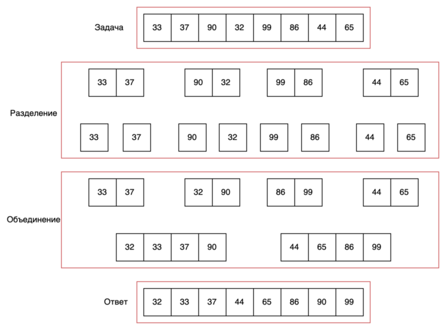

# Разделяй и властвуй

**"Разделяй и властвуй"** — схема разработки алгоритмов, заключающаяся в рекурсивном разбиении решаемой задачи на две
или более подзадачи того же типа, но меньшего размера, и комбинировании их решений для получения ответа к исходной
задаче; разбиения выполняются до тех пор, пока все подзадачи не окажутся элементарными. Рекурсия естественным образом
подходит для решения задач данного класса. Основная идея схемы состоит в том, чтобы разбить задачу на две или более
сходных, но более простых подзадач, решить их поочерёдно и объединить их решения. Это отличает "разделяй и властвуй" от
других рекурсивных алгоритмов, которые последовательно решают более простые задачи, сводящиеся к базовому случаю.
Примером последних может служить бинарный поиск, класс таких задач называют **"уменьшай и властвуй"**.

Алгоритм "разделяй и властвуй" состоит из трех шагов:

1. Разбиение изначальной проблемы на несколько более простых задач
1. Решение каждой под задачи рекурсивным способом
1. Объединение решений подзадач в одно общее решение

Ниже приведено наглядное представление алгоритма сортировки слиянием, которая реализует принципы "разделяй и властвуй".

   
