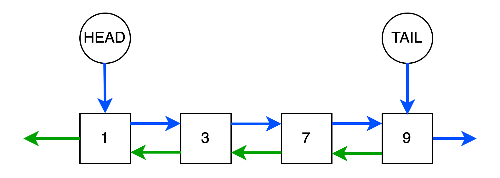

## Двусвязный список

В то время как объекты односвязного списка хранят ссылки только на следующие элементы, в двусвязном списке присутствуют
обе связи на следующий и предыдущий элемент.



На рисунке выше синяя стрелка отображает связь на следующий элемент, а зеленая - на предыдущий. Как и в односвязном
списке, у структуры определены два указателя ``HEAD`` и ``TAIL`` на корневой ``head`` и конечный ``tail`` узлы
соответственно.

Каждый узел в двусвязном списке содержит не только значение, но и ссылку на следующий и предыдущий элемент. Программно
его можно представить так:

```python
@dataclass
class DoublyListNode:
    """
    Узел двусвязного списка
    """
    val: int
    prev: Optional['DoublyListNode'] = None
    next: Optional['DoublyListNode'] = None
```

## Линейный поиск и доступ к элементу по индексу по двусвязному списку

Аналогично односвязному списку, в двусвязном мы также имеем:

1. Мы не можем получить доступ к произвольному элементу за константное время.
2. Для поиска значения в списке необходимо обойти все элементы начиная с головного.
3. В худшем случае поиск элемента занимает линейное время **O(n)**.

## Вставка элемента в двусвязный список

Рассмотрим три вида вставки: вставка элемента в середину, в "голову" и в "хвост".

**Вставка в начало** изображена ниже. Алгоритм вставки следующий:

1. Создаем узел ``cur`` и устанавливаем ``next`` у него на ``head``
2. Если ``head`` уже существует и список не пустой, то у ``head`` устанавливаем ``prev`` на ``cur``
3. Если ``tail`` не инициализирован (т.е. добавляемый ``cur`` первый в списке), то устанавливаем ``tail`` как ``cur``
4. Переназначаем ``head`` на ``cur``


**Вставку элемента в середину** можно разделить на два шага:

1. Связывания вставляемого элемента ``cur`` с узлами ``prev`` и ``next``
2. Удаление старых связей для ``prev`` и ``next`` и дальнейшее их переназначение на ``cur``


Операция займет **O(1)** вне зависимости от того какой узел следующий или предыдущий задается. В отличие от односвязного
списка мы располагаем двумя связями. Следует заметить, что если происходит вставка по индексу, то изначально следует
получить ссылку на правый или левый узел, а это займет **O(n)**.

**Вставка в хвост** аналогична вставке в начало. Ее сложность оценивается в **O(1)**.

Временная сложность операций:

Вставка элемента в середину - **O(1)**. При условии, что задается узел для вставки, а не его индекс. Для вставки по
индексу **O(n)**.

Вставка элемента в "голову" - **O(1)**.

Вставка элемента в "хвост" - **O(1)**.

## Операция удаления элемента

Алгоритм **удаления из головы** следующий:

1. Берем голову ``head`` и инициализируем ``cur`` значением связи ``next``.
2. Если ``cur`` существует, удаляем у него значение связи ``prev``.
3. Если ``cur`` не существует, в списке один элемент и мы его удаляем. Поэтому обнуляем ``tail``.
4. Устанавливаем ``head`` как ``cur``

Рассмотрим **удаление из середины**.


В отличие от односвязного списка, где эта операция занимает **O(n)** из-за того, что нам требуется найти предыдущий
элемент для создания связи, двусвязный список имеет ссылку на ``prev``. Если мы хотим удалить существующий узел ``cur``,
мы можем просто связать его предыдущий узел ``prev`` со следующим узлом ``next``. Временная сложность **O(1)**.

Удаление из конца списка аналогично удалению из головы, поэтому имеет временную сложность **O(1)**.

Временная сложность операций:

Удаление элемента из "головы" - **O(1)**.

Удаление элемента из середины - **O(1)**. При условии, что задается узел для вставки, а не его индекс. Для удаления по
индексу **O(n)**.

Удаление элемента из "хвоста" - **O(1)**.

## Реализация двусвязного списка на языке python

```python
"""
DoublyLinkedList
"""
from dataclasses import dataclass
from typing import Optional


@dataclass
class DoublyListNode:
    """
    Узел двусвязного списка
    """
    val: int
    prev: Optional['DoublyListNode'] = None
    next: Optional['DoublyListNode'] = None


class DoublyLinkedList:
    """
    Реализация двусвязного списка
    """

    def __init__(self):
        self.head = None
        self.tail = None
        self.len = 0

    def get(self, index: int) -> Optional[DoublyListNode]:
        """ Получение узла по индексу """
        cur = self.head
        idx = 0
        while idx != index:
            if not cur:
                return None

            cur = cur.next
            idx += 1

        return cur

    def add_at_head(self, val: int) -> DoublyListNode:
        """ Добавление в голову """
        cur = DoublyListNode(val)
        cur.next = self.head
        if self.head:
            self.head.prev = cur
        if not self.tail:
            self.tail = cur

        self.head = cur
        self.len += 1

        return cur

    def add_at_tail(self, val: int) -> DoublyListNode:
        """ Добавление в хвост """
        cur = DoublyListNode(val)
        cur.prev = self.tail
        if self.tail:
            self.tail.next = cur
        if not self.head:
            self.head = cur

        self.tail = cur
        self.len += 1

        return cur

    def add_at_index(self, index: int, val: int) -> Optional[DoublyListNode]:
        """ Добавление по индексу """
        if index > self.len:
            return None

        right = self.get(index)
        if not right:
            return self.add_at_tail(val)

        left = right.prev
        if not left:
            return self.add_at_head(val)

        cur = DoublyListNode(val)
        cur.prev = left
        cur.next = right
        left.next = cur
        right.prev = cur
        self.len += 1
        return cur

    def delete_at_index(self, index: int) -> None:
        """ Удаление по индексу """
        curr = self.get(index)
        if not curr:
            return None

        left = curr.prev
        right = curr.next

        if not left:
            return self.delete_at_head()

        if not right:
            return self.delete_at_tail()

        right.prev = left
        left.next = right
        self.len -= 1

        return None

    def delete_at_head(self) -> None:
        """ Удаление из головы """
        if not self.head:
            return None

        cur = self.head.next
        if cur:
            cur.prev = None
        else:
            # Если в списке один элемент и мы его удаляем
            self.tail = None

        self.head = cur
        self.len -= 1

        return None

    def delete_at_tail(self) -> None:
        """ Удаление с хвоста """
        if not self.tail:
            return None

        cur = self.tail.prev
        if cur:
            cur.next = None
        else:
            # Если в списке один элемент и мы его удаляем
            self.head = None

        self.tail = cur
        self.len -= 1

        return None
```