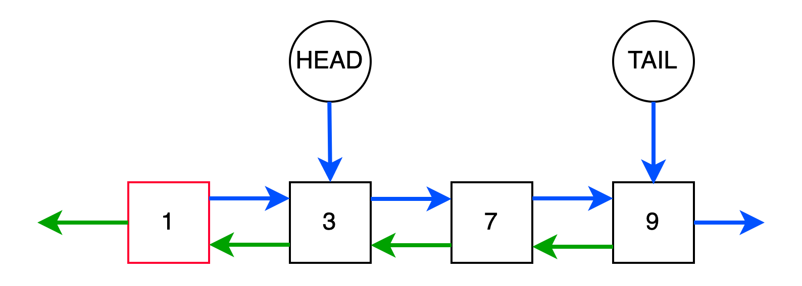
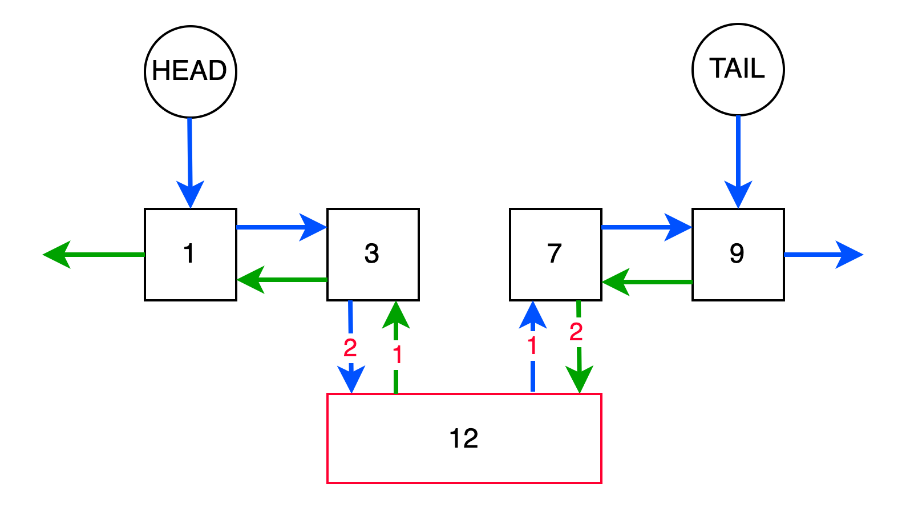

## Двусвязный список

В то время как объекты односвязного списка хранят ссылки только на следующие элементы, в двусвязном списке присутствуют
обе связи на следующий и предыдущий элемент.


На рисунке выше синяя стрелка отображает связь на следующий элемент, а зеленая - на предыдущий. ``HEAD`` -
указатель, хранящий ссылку на головной узел. Заметим, что доступ к хвосту списка осуществляется за счет ``HEAD`` и связи
на предыдущий элемент ``prev``.

Каждый узел в двусвязном списке содержит не только значение, но и ссылку на следующий и предыдущий элемент. Программно
его можно представить так:

```
class DoublyListNode:
    """
    Узел двусвязного списка
    """
    def __init__(self, value, next_node, prev_node):
        self.value = value
        self.prev_node = prev_node
        self.next_node = next_node
```

Как и односвязный список, двусвязный также имеет два указателя ``HEAD`` и ``TAIL`` на корневой ``head`` и
конечный ``tail`` узлы соответственно.

## Линейный поиск и доступ к элементу по индексу по двусвязному списку

Аналогично односвязному списку, в двусвязном мы также имеем:

1. Мы не можем получить доступ к произвольному элементу за константное время.
2. Для поиска значения в списке необходимо обойти все элементы начиная с головного.
3. В худшем случае поиск элемента занимает линейное время **O(n)**.

## Вставка элемента в двусвязный список

Рассмотрим три вида вставки: вставка элемента в середину, в "голову" и в "хвост".



Вставку элемента в середину можно разделить на два шага:

1. Связывания вставляемого элемента ``cur`` с узлами ``prev`` и ``next``
2. Удаление старых связей ``prev``->``next`` и дальнейшее их переназначение на ``cur``

Операция займет **O(n)** вне зависимости от того какой узел следующий или предыдущий задается. В отличие от односвязного
списка мы располагаем двумя связями.

Вставка в голову и хвост аналогична тому, как это осуществляется в односвязном списке. Всегда ее сложность оценивается в
**O(1)**.

Временная сложность операций:

Вставка элемента в середину - **O(1)**.

Вставка элемента в "голову" - **O(1)**

Вставка элемента в "хвост" - **O(1)**.

## Операция удаления элемента

Рассмотрим удаление из середины.



В отличие от односвязного списка, где эта операция занимает **O(n)** из-за того, что нам требуется найти предыдущий
элемент для создания связи, двусвязный список имеет ссылку на ``prev``. Если мы хотим удалить существующий узел ``cur``,
мы можем просто связать его предыдущий узел ``prev`` со следующим узлом ``next``. Временная сложность **O(1)**.

Удаление из начала и конца списка является частным случаем удаление из середины, поэтому имеет временную сложность **O(
1)**.

Временная сложность операций:

Удаление элемента из "головы" - **O(1)**

Удаление элемента из середины - **O(1)**

Удаление элемента из "хвоста" - **O(1)**