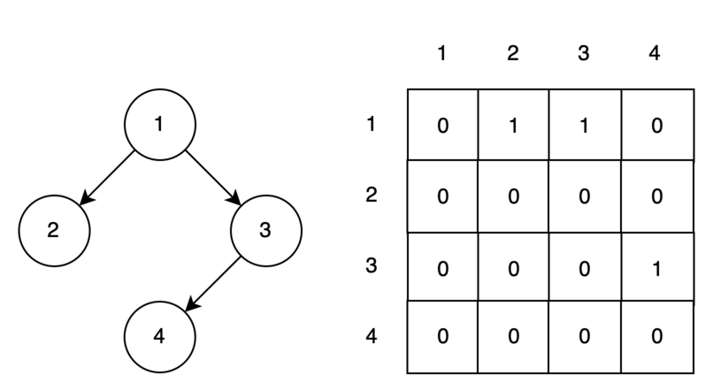

# Графы

Граф (graph, G) — это нелинейная структура данных, состоящая из множества элементов и связей между ними. Элементы
называются вершинами графа и обозначаются V(vertices), а связи — ребрами, обозначаются как E (edges). Существует разные
виды графов, рассмотрим несколько из них:

**Ненаправленный граф** - граф у которого ребра между вершинами не имеют определенного направления, т.е. из одной
вершины в другую можно попасть как в прямом, так и в обратном направлении.

**Направленный граф** — это граф, у которого из одной вершины в другую можно попасть только одним способом, т.е. ребра
имеют определенные направления.

**Взвешенные графы** отличаются тем, что их ребра имеют определенный вес, определяющий некоторую метрику перехода между
соединяемыми вершинами.

Все виды графов изображены на рисунке ниже.

Помимо вершин и ребер граф определяется следующей терминологией:

**Путь между вершинами** описывает способ перехода из одной вершины в другую. Может существовать несколько путей для
перехода. Например, для взвешенного графа существует три способа перехода из вершины V1 в V5: V1-V2-V5, V1-V3-V5,
V1-V3-V4-V5.

**Длина пути** определяется количеством ребер в нем. Например, пути V1-V2-V5, V1-V3-V5, V1-V3-V4-V5 имеют длины 2, 2 и 3
соответственно.

**Цикл** - путь в графе, где начальная и конечная точка совпадают. Например, если рассматриваемый взвешенный граф был бы
ненаправленным, то путь V1-V3-V5-V2-V1 являлся бы циклом.

**Отрицательный вес цикла** характерен только для взвешенного графа. Вес цикла — это сумма всех весов ребер цикла. Если
это значение отрицательно, то можем говорить об отрицательном весе всего цикла.

**Связность вершин.** Если все вершины графа имеют между собой хотя бы один путь, то мы можем называть его связным.
Напротив, вершины несвязного графа могут быть разделены по группам, которые называются компонентами связности.

**Инцидентность** – это когда вершина V является началом или концом ребра E.

**Степень, или валентность вершины**, графа — количество рёбер графа G, инцидентных вершине V. Данное определение
применимо только для невзвешенных графов. Другими словами, валентность вершины, это количество ребер, которые соединяют
данную вершину с другими вершинами. Для направленного графа, валентность вершины V1 равно двум.

**Входящая и исходящая валентности вершин** определены только для направленного графа. Входящая in-degree валентность
вершины определяется количеством ребер, направленных **в** вершину. Исходящая out-degree валентность вершины
определяется количеством ребер, направленных **из** вершины. Для рассматриваемого взвешенного, направленного графа
in-degree валентность вершины V3 составляет 1, out-degree - 2.

**Кратчайший путь** - это один из всевозможных путей от одной вершины до другой с минимальным количеством ребер, т.е. с
минимальной длиной.

## Представление графов в памяти

**Матрица смежности** — один из способов представить граф в памяти компьютера. Номера строк и столбцов обозначают номера
вершин, если вершина i связна с вершиной j, то в ячейке матрицы (i, j) записывается значение 1, в противном случае 0.

**Список смежности** содержит в себе информацию только о связанных вершинах. Как видим, он более экономный по памяти,
чем матрица смежности.

**Список ребер** - граф также можно представить в виде списка значений вида [(1,2), (1,3), (3,4)]. Элементы массива
представляют собой ребра графа. В ненаправленном графе порядок вершин не важен, в направленном важен.

Матрицу и список смежности, а также список ребер можно реализовать на основе простого массива. 