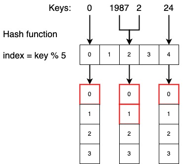

# Хеш таблицы



Хеш таблица - структура данных, которая использует хеш функцию для определения порядка хранения элементов. Различают два
вида хеш таблиц:

1. Множества - неупорядоченная, изменяемая последовательность уникальных элементов.
2. Словари - изменяемая последовательность элементов, содержащих в себе ключ и сами данные.

Основные преимущества хеш таблиц - это быстрая вставка и поиск элементов, временная сложность этих операций
составляет **O(1)**.

Ключевой идеей в реализации хеш таблиц является хеш функция, которая определяет индекс хранения элемента. При вставке
элемента хеш функция вычисляет индекс ячейки, куда будет вставлен новый элемент. При поиске элемента та же самая функция
вычисляет его расположение.

## Хеш функция

Если говорить простым языком, хеш-таблица – это массив, индекс которого вычисляется на основе хеш-функции по ключу. Если
для разных ключей хеш-функция возвращает одинаковый результат своего выполнения, то говорят о том, что произошла
коллизия, поэтому основная задача хеш-функции избегать коллизий и компактно «укладывать» объекты в таблицу.

Основной массив хранит набор так называемых корзин или сегментов. Каждый сегмент также можно представить в виде массива
элементов, хеш функция для которых возвращает одинаковое значение. На рисунке выше схематически представлено устройство
хеш-таблицы. Так для ключа ``0``, хеш функция ``key % 5`` вернула нулевой индекс, а для ключей ``1987`` и ``2`` индекс
совпал. В таком случае в связанную с индексом ``2`` корзину добавятся 2 элемента. Из этого следует вывод, что

```
Хеш-функция будет зависеть от диапазона значений ключа и общего количества сегментов. 
```

Основная задача хеш функции - равномерно заполнять основной массив и делать размер корзин как можно меньше. Идеальная
хеш функция та, при которой ячейка основного массива однозначно соотносится с элементом. Однако в большинстве случаев
хеш-функция не идеальна и всегда приходится искать компромисс между количеством сегментов и их емкостью.

Обратите внимание, что хеш-функция возвращает одно и то же значение только для неизменяемых объектов. Если в список было
добавлено новое значение, функция вернет новый результат. Именно поэтому в хеш таблице хранить(или использовать в
качестве ключа) изменяемые типы данных запрещено. Иначе при изменении значения, должен измениться его индекс, а это
недопустимо.

## Разрешение коллизий

Идеальная кеш функция не подвержена коллизиям - ячейка основного массива однозначно соотносится с элементом.

Алгоритм разрешения коллизий должен решать следующие вопросы:

1. Как реализовать хранение значений в одной корзине?
2. Что делать, если одной корзине назначено слишком много значений?
3. Как производить поиск элемента в корзине?

Все эти вопросы связаны с текущей длиной и общей вместимостью корзины. Если количество ключей корзины небольшое можно
использовать простой массив. Если количество большое - сбалансированное по высоте бинарное дерево.

## Оценка эффективности хеш таблиц

Если мы имеем ``M`` ключей в таблице, то **пространственная** сложность составляет **O(M)**.

Временная сложность тесно связана с устройством корзин. Если принять, что это массивы с достаточно малым размером ``N``,
то можно допустить, что временная сложность поиска и вставки константная - **O(1)**. В худшем случае при плохой хеш
функции и большом ``N``, временная сложность для массива составит **O(N)** для поиска и **O(1)** для вставки. Если
корзина реализована как сбалансированное по высоте бинарное дерево, то временная сложность поиска и вставки равна
**O(log(N))**.

## Множества

Множества - неупорядоченная, изменяемая последовательность уникальных элементов. Помимо уникальности, все объекты
множества должны быть хешируемыми. Отличительной особенностью множества являются математические операции над ними:
объединение, пересечение, разность и симметрическая разность.

Временная сложность операций над множествами:

Добавление элемента - **O(1)**

Удаление элемента - **O(1)**

Проход по множеству - **O(M)**

Проверка вхождения элемента - **O(1)**

Получение длины последовательности - **O(1)**

Хотя все три операции (поиск, вставка, удаление элементов) в среднем выполняются за время O(1), требуется дополнительное
время на вычисление хеш-функции, и если её вычисление будет неэффективным, то и все операции над множеством будут иметь
увеличенную временную сложность.

```
Основной сценарий использования множеств - это проверка того, встречался ли элемент ранее.
```

## Словари

Словарь – это изменяемая последовательность элементов, содержащих в себе ключ и сами данные. Если в списках и кортежах
мы могли взять значение по индексу, то в словарях используется ключ. Объект dict не хешируемый, однако в качестве ключей
можно использовать только хешируемые типы данных.

Временная сложность операций над словарями:

Добавление элемента - **O(1)**

Удаление элемента - **O(1)**

Проход по словарю - **O(M)**

Проверка вхождения ключа - **O(1)**

Получение длины последовательности - **O(1)**

Взятие элемента по ключу - **O(1)**

```
Основной сценарий использования словарей - это хранение дополнительной информации, связанной с ключем.
```

К примеру дан массив целых чисел, верните индексы двух чисел таким образом, чтобы в сумме они ровнялись определенному
числу. ``array = [1, 3, 7, 9]``, ``target = 12``. Если бы требовалось проверить только наличие двух чисел, мы могли бы
пробегаться по array, вычислять разницу ``diff = target - current_value`` и, используя дополнительный объект set,
проверять, входит ли в него diff. Однако нам нужно вернуть индексы элементов, поэтому помимо diff следует также хранить
индекс.

```
Другой частый сценарий - это агрегация некой информации по ключу.
```

Дана строка. Найдите в ней любой неповторяющийся символ и верните его индекс. Если он не существует, верните -1. Самый
простой способ решить эту задачу — это подсчитать для каждого символа количество его появлений в строке. А затем
пройтись по полученным результатам, для определения первого уникального символа. Например, для слова ``собака`` получим
``{'с': 1, 'о': 1, 'б': 1, 'а': 2, 'к', 1}``. Первый символ, который встречается один раз - ``с``.

