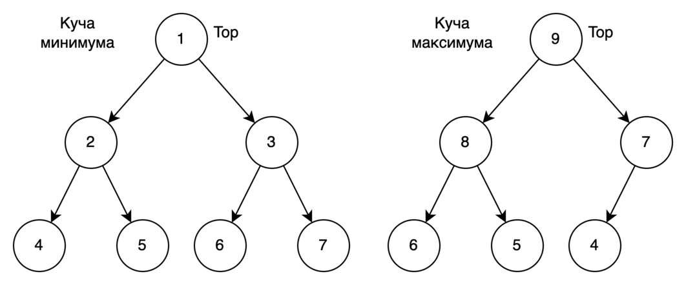
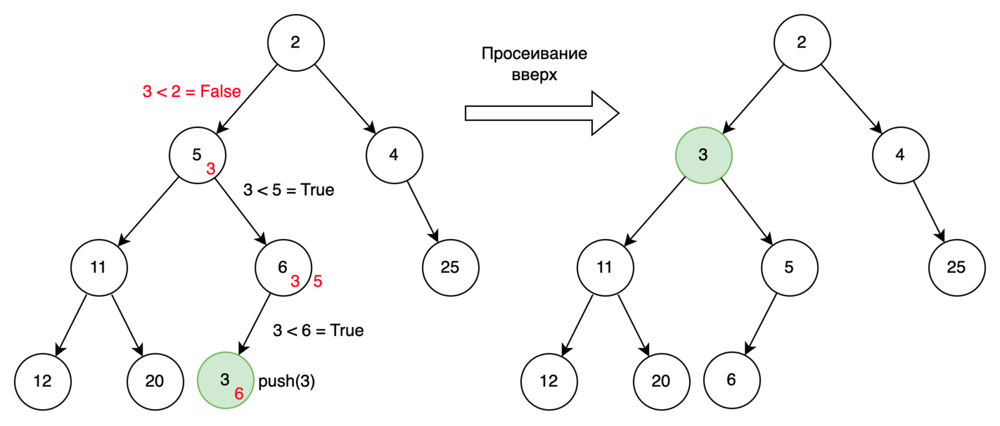
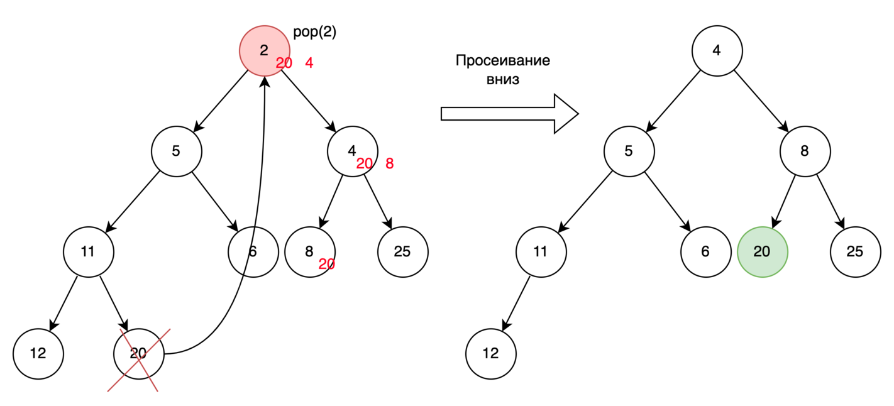
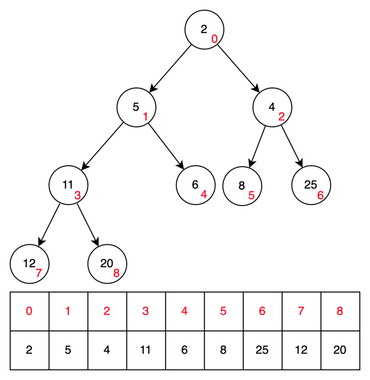

# Куча

**Куча** - это полное бинарное дерево, обладающее следующими свойствами:

1. Для **кучи минимумов** каждый узел в куче имеет значение, не превышающее значений его дочерних узлов. Следовательно,
   верхний элемент (корневой узел) имеет **наименьшее** значение в куче. Для **кучи максимумов** каждый узел в куче
   имеет значение, не меньше значений его дочерних узлов. Следовательно, верхний элемент (корневой узел) имеет
   **наибольшее** значение в куче.
1. Все уровни кучи, кроме, возможно, последнего, полностью заполнены, а все узлы последнего уровня максимально левые.
   Таким образом заполнение производится по уровням слева направо.

Ниже представлены два вида кучи: кучи минимума и максимума.



## Операции просеивания

Операции просеивания используются после вставки и удаления элемента для того, чтобы выполнялось основное свойство кучи о
ключах(п.1). Различают просеивание вверх и просеивание вниз. Рассмотрим каждый алгоритм более детально. Далее будем
рассматривать кучу минимума.

## Вставка элемента

**Просеивание вверх** - это всплытие добавленного листа дерева до тех пор, пока не будет выполнено условие, что новый
узел в куче имеет значение большее значения родителя и не превышающее значений его дочерних узлов. Таким образом мы
меняем просеиваемый узел с родителем до тех пор, пока он не станет корнем или пока его значение меньше значение
родителя.



Сложность данной операции **O(logN)**.

## Удаление элемента

**Просеивание вниз** - это погружение самого верхнего элемента, пока он не будет удовлетворять основному свойству кучи о
ключах. Алгоритм следующий:

1. Берем самый правый в последнем ряду элемент и переносим его на место удаляемого элемента, т.е. на вершину кучи.
   Определяем элемент как просеиваемый.
1. Если у просеиваемого элемента два сына, определяем среди них того, у которого меньший ключ. Меняем этот узел с
   просеиваемым если нужно.
1. Если у просеиваемого элемента один сын, меняем этот узел с просеиваемым если нужно.
1. Если после перестановки у просеиваемого элемента нет сыновей, то завершаем алгоритм, свойство кучи восстановлено.



Сложность данной операции **O(logN)**.

## Определение минимального или максимального элемента

Свойство ключей кучи гарантирует, что на ее вершине будет всегда находиться минимальный или максимальный элемент.
Поэтому эта операция очень простая и состоит в чтении с вершины кучи.

Сложность данной операции **O(1)**.

## Реализация кучи в памяти

Для реализации кучи очень удобно использовать массив. Для этого мы нумеруем узлы кучи подряд по слоям слева направо, и в
таком порядке располагаем их в обычном массиве.



Тогда индексы хранения левого и правого ребенка для i-ого элемента будут ``2 * i + 1`` и ``2 * i + 2`` соответственно.
Индекс родителя вычисляется по формуле ``(i - 1 ) // 2``. Ниже представлена реализация кучи минимума на python.
Представление в виде массива значительно сокращает использование памяти по сравнению с классической реализацией бинарных
деревьев в виде объектов и ссылок на них.

```python
class MinHeap:
    """ Реализация кучи минимумов на python с использованием массива """

    def __init__(self):
        self.heap_list = []

    def is_empty(self):
        return not bool(self.heap_list)

    def push(self, key: int):
        """ Добавление в кучу """
        self.heap_list.append(key)
        cur_idx = len(self.heap_list) - 1
        while cur_idx > 0 and self.heap_list[cur_idx] < self._get_parent(cur_idx):
            parent_idx = _get_parent_index(cur_idx)
            # Меняем текущий элемент с родителем
            self.heap_list[cur_idx], self.heap_list[parent_idx] = self.heap_list[parent_idx], self.heap_list[cur_idx]
            cur_idx = parent_idx

    def peek(self):
        """ Получение минимума """
        if len(self.heap_list) > 0:
            return self.heap_list[0]

        return None

    def pop(self):
        """ Извлечение с вершины кучи """
        if len(self.heap_list) == 1:
            return self.heap_list.pop()

        result = self.peek()
        # Берем самый правый в последнем ряду элемент и переносим его на место удаляемого элемента
        self.heap_list[0] = self.heap_list.pop()
        cur_idx = 0

        while True:
            max_idx = len(self.heap_list) - 1

            left_idx = _get_left_child_index(cur_idx)
            right_idx = _get_right_child_index(cur_idx)

            if left_idx > max_idx and right_idx > max_idx:
                #  Если после перестановки у просеиваемого элемента нет сыновей, то завершаем алгоритм
                break

            if left_idx <= max_idx and right_idx <= max_idx:
                # Если у просеиваемого элемента два сына
                max_child_idx = left_idx if self.heap_list[left_idx] < self.heap_list[right_idx] else right_idx
            elif left_idx <= max_idx:
                max_child_idx = left_idx
            else:
                max_child_idx = right_idx

            if self.heap_list[max_child_idx] < self.heap_list[cur_idx]:
                self.heap_list[cur_idx], self.heap_list[max_child_idx] = self.heap_list[max_child_idx], self.heap_list[
                    cur_idx]
                cur_idx = max_child_idx
            else:
                break

        return result

    def _get_parent(self, idx: int) -> int:
        """ Получение родительского ключа """
        parent_idx = _get_parent_index(idx)
        return self.heap_list[parent_idx]

    def __str__(self):
        return str(self.heap_list)


class MaxHeap:
    """ Реализация кучи максимума на python с использованием массива """

    def __init__(self):
        self.heap_list = []

    def is_empty(self):
        return not bool(self.heap_list)

    def push(self, key: int):
        """ Добавление в кучу """
        self.heap_list.append(key)
        cur_idx = len(self.heap_list) - 1
        while cur_idx > 0 and self.heap_list[cur_idx] > self._get_parent(cur_idx):
            parent_idx = _get_parent_index(cur_idx)
            # Меняем текущий элемент с родителем
            self.heap_list[cur_idx], self.heap_list[parent_idx] = self.heap_list[parent_idx], self.heap_list[cur_idx]
            cur_idx = parent_idx

    def peek(self):
        """ Получение минимума """
        if len(self.heap_list) > 0:
            return self.heap_list[0]

        return None

    def pop(self):
        """ Извлечение с вершины кучи """
        if len(self.heap_list) == 1:
            return self.heap_list.pop()

        result = self.peek()
        # Берем самый правый в последнем ряду элемент и переносим его на место удаляемого элемента
        self.heap_list[0] = self.heap_list.pop()
        cur_idx = 0

        while True:
            max_idx = len(self.heap_list) - 1

            left_idx = _get_left_child_index(cur_idx)
            right_idx = _get_right_child_index(cur_idx)

            if left_idx > max_idx and right_idx > max_idx:
                #  Если после перестановки у просеиваемого элемента нет сыновей, то завершаем алгоритм
                break

            if left_idx <= max_idx and right_idx <= max_idx:
                # Если у просеиваемого элемента два сына
                max_child_idx = left_idx if self.heap_list[left_idx] > self.heap_list[right_idx] else right_idx
            elif left_idx <= max_idx:
                max_child_idx = left_idx
            else:
                max_child_idx = right_idx

            if self.heap_list[max_child_idx] > self.heap_list[cur_idx]:
                self.heap_list[cur_idx], self.heap_list[max_child_idx] = self.heap_list[max_child_idx], self.heap_list[
                    cur_idx]
                cur_idx = max_child_idx
            else:
                break

        return result

    def _get_parent(self, idx: int) -> int:
        """ Получение родительского ключа """
        parent_idx = _get_parent_index(idx)
        return self.heap_list[parent_idx]

    def __str__(self):
        return str(self.heap_list)


def _get_parent_index(i: int) -> int:
    """ Индекс родителя """
    return (i - 1) // 2


def _get_left_child_index(i: int) -> int:
    """ Индекс левого ребенка """
    return 2 * i + 1


def _get_right_child_index(i: int) -> int:
    """ Индекс правого ребенка """
    return 2 * i + 2
```