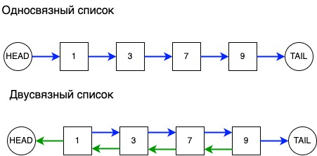

# Связанные списки



Связанный список - это линейная структуры данных, элементы в которой хранят ссылки на следующие объекты списка и
располагаются в разных фрагментах памяти. Различают односвязные и двусвязные списки. На рисунке выше изображены оба вида
этой структуры данных. Синяя стрелка отображает связь на следующий элемент, а зеленая - на предыдущий.

## Односвязный список

Каждый узел в односвязном списке содержит не только значение, но и ссылку на следующий элемент. Программно его можно
представить так:

```
class SinglyListNode:
    """
    Узел односвязного списка
    """
    def __init__(self, value, next_node):
        self.value = value
        self.next_node = next_node

```

Т.о. односвязный список можно определить головным(первым) узлом.

В отличие от массива, используя односвязный список, мы не можем получить доступ к элементу по индексу за константное
время. Чтобы получить i-ый элемент, мы должны пройтись по всем связям с первого узла до i-ого. Это имеет временную
сложность **O(n)**.

## Вставка элемента в односвязный список

Чтобы вставить элемент после заданного узла ``prev``, необходимо:


1. Инициализировать новый узел ``cur`` с заданным значением.
2. Связать ``cur`` с узлом ``next``, который следует после ``prev``.
3. Связать ``prev`` с узлом ``cur``.

В отличие от массива, мы не должны сдвигать все элементы в право для вставки. Мы просто инициализируем новый элемент и
переопределяем связи. Эта операция очень эффективна и имеет константную сложность **O(1)**.

## Двусвязный список

В то время как объекты односвязного списка хранят ссылки только на следующие элементы, в двусвязном списке присутствуют
обе связи на следующий и предыдущий элементы. 
