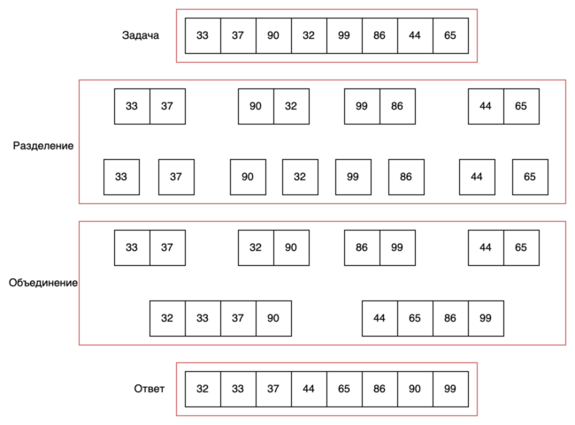

# Сортировка слиянием

Одним классическим примером алгоритма "разделяй и властвуй" является сортировка слиянием.

Существует два подхода реализации сортировки слиянием "сверху вниз" и "снизу вверх". Первый вариант можно просто
реализовать с использованием рекурсии. Задача сортировки слиянием ставится и решается следующим образом:

1) Дан неотсортированный список, например список чисел. Требуется отсортировать список в порядке возрастания или
   убывания.  
2) На первом шаге разделим данный список на два  
3) На следующем шаге рекурсивно отсортируем два списка, полученные на первом шаге. В процессе рекурсии сортируемые  
   списки будут становиться все меньше, пока не станут пустыми или не будут состоять из одного элемента. Это будет базой
   рекурсии.  
4) Наконец мы объединяем отсортированные списки, полученные на предыдущем шаге.  

Алгоритм сортировки слиянием представлен ниже.



Итак, после разбиения двух списков необходимо провести слияние. Сложность этого шага будет O(n), где n - общее
количество элементов в двух списках. Слияние реализуется с использованием двух указателей и дополнительного списка


Реализация сортировки слиянием на python:

```python
def merge_sort(nums):
    """
    Сортировка
    """
    # Базовый случай
    if len(nums) <= 1:
        return nums
    # Разделяем
    pivot = int(len(nums) / 2)
    # Рекурсивно решаем более простую задачу
    left_list = merge_sort(nums[0:pivot])
    right_list = merge_sort(nums[pivot:])
    # Объединяем
    return merge(left_list, right_list)


def merge(left_list, right_list):
    """
    Слияние
    """
    left_cursor = right_cursor = 0
    ret = []
    while left_cursor < len(left_list) and right_cursor < len(right_list):
        if left_list[left_cursor] < right_list[right_cursor]:
            ret.append(left_list[left_cursor])
            left_cursor += 1
        else:
            ret.append(right_list[right_cursor])
            right_cursor += 1

    ret.extend(left_list[left_cursor:])
    ret.extend(right_list[right_cursor:])

    return ret
```

В подходе "снизу вверх", мы делим список на подсписки по 1 элементу и затем рекурсивно объединяем их уже известным нам
способом.


Реализация сортировки слиянием методом снизу вверх выглядит следующим образом:

```python
from collections import deque


def merge_sort(nums):
    """
    Sort
    """
    # Divide and conquer
    res = deque([[i] for i in nums])
    # Merge
    while len(res) > 1:
        one = res.popleft()
        two = res.popleft()
        res.append(merge(one, two))

    return res[0]


def merge(left_list, right_list):
    """
    Merge
    """
    left_cursor = right_cursor = 0
    ret = []
    while left_cursor < len(left_list) and right_cursor < len(right_list):
        if left_list[left_cursor] < right_list[right_cursor]:
            ret.append(left_list[left_cursor])
            left_cursor += 1
        else:
            ret.append(right_list[right_cursor])
            right_cursor += 1

    ret.extend(left_list[left_cursor:])
    ret.extend(right_list[right_cursor:])

    return ret
```