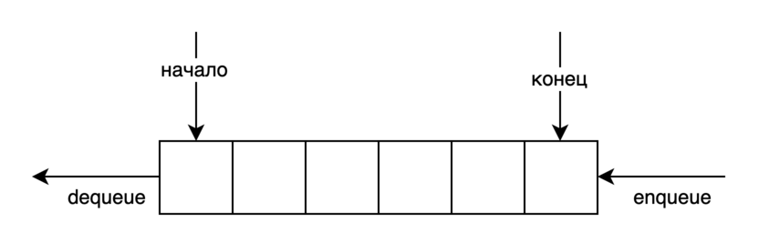
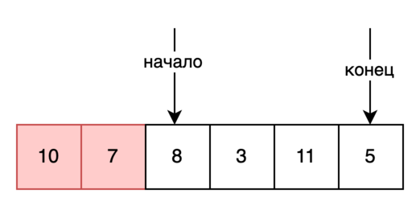
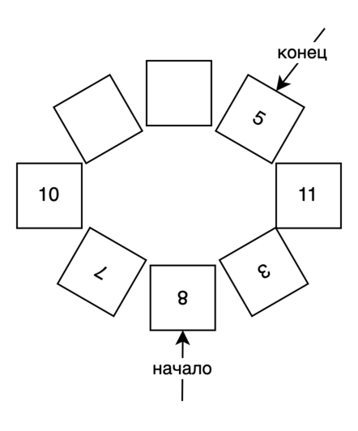
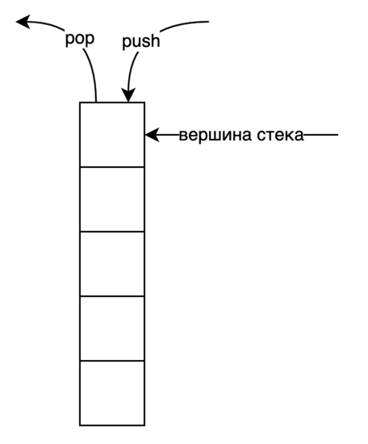

# Очередь и стек

В этом разделе мы познакомимся с абстрактными структурами данных такими как очередь и стек. В них обработка элементов
происходит в определенном, строго заданном порядке.

## Очередь

Очередь - структура типа ``First-in-first-out (FIFO)`` или первый пришел, первый вышел. В ней элемент, добавленный
первым, первым пройдет обработку. На рисунке изображена очередь, которая имеет начало(голову) и конец(хвост). Операция
вставки ``enqueue`` всегда добавляет новый элемент в конец очереди. Операция удаления ``dequeue`` всегда удаляет элемент
из начала очереди.



Для реализации очереди мы могли бы использовать обычный динамический массив и указатель ``head`` на индекс начального
элемента в голове. Однако данный подход имеет один недостаток. Рассмотрим рисунок ниже.



Предположим мы добавили в очередь 6 элементов, затем удалили 2 элемента из головы. Указатель ``head`` установлен на
число 8. Удаленные элементы 10 и 7 занимают больше неиспользуемое место. С ростом количества элементов этот объем будет
только увеличиваться. Как видим, в данном варианте реализации память расходуется очень неэффективно.

Для решения данной проблемы используется такой прием как **кольцевой буфер**. Здесь следует заранее знать максимальную
длину очереди и при добавлении элементов в конец возможна перезапись уже неиспользуемых элементов. Для реализации
данного вида очереди удобно использовать массив фиксированного размера и два указателя ``head`` и ``tail``.



Пример реализации кольцевого буфера представлена ниже:

```python
from typing import Optional


class MyCircularQueue:
    """
    Реализация очереди в виде кольцевого буфера
    """

    def __init__(self, k: int):
        """
        Очередь
        :param k: максимальный размер очереди
        """
        self.capacity = k
        self._len = 0
        self._data = [None for _ in range(k)]
        self._head = -1
        self._tail = -1

    def enqueue(self, value: int) -> bool:
        """
        Операция вставки всегда добавляет новый элемент в конец очереди
        :param value: элемент для вставки
        :return: True, если операция успешна
        """
        if self.is_full():
            return False

        if self._head == -1 and self._tail == -1:
            self._head = 0
            self._tail = 0
        else:
            self._tail += 1

        if self._tail == self.capacity:
            self._tail = 0

        self._len += 1
        self._data[self._tail] = value

        return True

    def dequeue(self) -> bool:
        """
        Операция удаления всегда удаляет элемент из начала очереди.
        :return: True, если операция успешна
        """
        if self.is_empty():
            return False

        self._data[self._head] = None
        self._head += 1

        if self._head == self.capacity:
            self._head = 0

        self._len -= 1

        return True

    def front(self) -> Optional[int]:
        """
        Получение элемента из головы.
        :return: элемент
        """
        if self.is_empty():
            return None

        return self._data[self._head]

    def rear(self) -> Optional[int]:
        """
        Получение элемента из хвоста
        :return:
        """
        if self.is_empty():
            return None

        return self._data[self._tail]

    def is_empty(self) -> bool:
        """
        Очередь пуста.
        :return: True, если очередь пуста.
        """
        return self._len == 0

    def is_full(self) -> bool:
        """
        Очередь заполнена.
        :return: True, если очередь заполнена.
        """
        return self._len == self.capacity
```

## Стек

Стек - структура типа ``Last-in-first-out (LIFO)`` или последний пришел, первый вышел. В ней элемент, добавленный
последним, первым пройдет обработку. На рисунке изображен стек, где типичные операции вставки и изъятия работают с
вершиной стека. Операция вставки ``push`` кладет новый элемент на вершину стека. Операция удаления ``pop`` всегда
снимает элемент с вершины. Получить элемент по его индексу, например, из середины данная структура данных не позволяет.



Для реализации стека достаточно динамического массива. В python объект list легко использовать как стек. Для добавления
элемента на вершину следует использовать метод ``append()``, а для снятия с вершины - метод ``pop()`` без указания
индекса. Также для реализации стека подойдут односвязный или двусвязный списки.

Ниже приведена временная сложность операций для стека:

1. Получение верхнего элемента стека(top) - **O(1)**.
2. Добавление нового элемента на вершину(push) - **O(1)**.
3. Удаление элемента с вершины(pop) - **O(1)**.