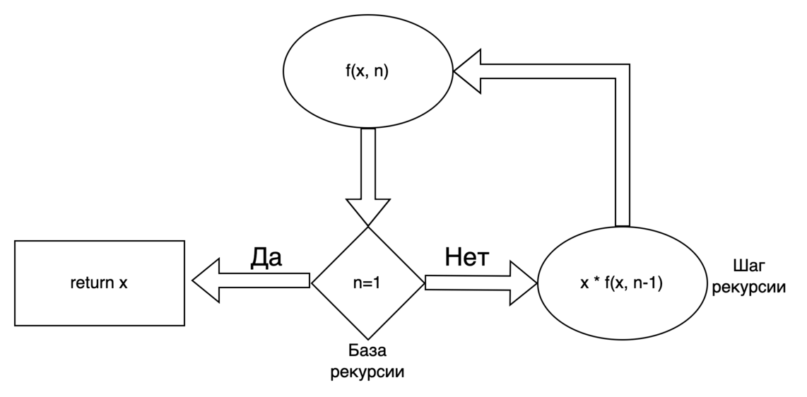
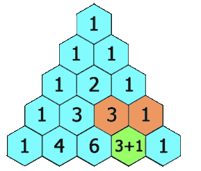

# Рекурсия

Функция называется **рекурсивной**, если в процессе своего выполнения она вызывает сама себя. Суть рекурсии состоит в
разбиении одной большой задачи на более простые однотипные подзадачи, которые поступают на вход рекурсивному вызову.

Ветвь алгоритма, на которой задача сводится к более простой, и происходит рекурсивный вызов, называется **шагом
рекурсии** или **рекуррентным соотношением**.

Процесс повторяется до тех пор, пока очередную подзадачу нельзя разбить на более мелкие. Эта часть алгоритма
называется **базой рекурсии**. Другими словами, база рекурсии — это условие при котором функция прекращает вызывать саму
себя. База рекурсии позволяет выйти из цикла вызовов функции.

Python и прочие языки программирования имеют ограничение на количество вложенных вызовов функций или **глубину
рекурсии**, по умолчанию для python это значение равно 1000. Ниже приведена схема рекурсивного алгоритма.



Реализация рекурсивных вызовов функций неотрывно связана с такой структурой данных, как **стек вызовов** — адрес
возврата и локальные переменные функции записываются в стек, благодаря чему каждый следующий рекурсивный вызов этой
функции пользуется своим набором локальных переменных. Следует понимать, что при таком подходе на каждый рекурсивный
вызов требуется некоторое количество оперативной памяти, и при чрезмерно большой глубине рекурсии может наступить
переполнение стека вызовов. Поэтому иногда бывает целесообразно заменить рекурсию на итеративный подход.

Рассмотрим следующую задачу. Дан массив букв s. Напишите функцию, которая переворачивает строку задом наперед. Не
разрешается использовать дополнительную память, все преобразования должны производиться с исходным массивом.

Оригинал: [344. Reverse String](https://leetcode.com/problems/reverse-string/description/)

Реализация с использованием рекурсии

```python
from typing import List, Optional


def reverse_string(s: List[str], left: Optional[int] = 0) -> None:
    right = -(left + 1)
    if left > (len(s) // 2) - 1:
        return None

    reverse_string(s, left + 1)
    s[left], s[right] = s[right], s[left]
```

Итеративный подход с использованием двух указателей

```python
from typing import List


def reverse_string(s: List[str]) -> None:
    left, right = 0, len(s) - 1
    while left < right:
        s[left], s[right] = s[right], s[left]
        left += 1
        right -= 1
```

Сравнение использования ЦПУ и памяти


Как видим использование цикла сокращает потребление памяти, однако рекурсия иногда позволяет очень кратко и наглядно
решить поставленную задачу, например, рекурсию очень часто используют при обходе графов в глубину взамен явного
использования стека.

Итак, прежде чем реализовывать рекурсивную функцию, необходимо выяснить две важные вещи:

1. Определить базу рекурсии — т.е. случай, когда можно вычислить ответ напрямую без каких-либо дополнительных вызовов
   рекурсии.
2. Определить связь между результатом задачи и результатом ее подзадач, т.е. найти рекуррентное соотношение.

Чтобы показать это на примере, решим задачу про треугольник Паскаля, используя рекурсию.

Оригинал: [118. Pascal's Triangle](https://leetcode.com/problems/pascals-triangle/)

Требуется построить первые num_rows строк треугольника Паскаля. Треугольник Паскаля — бесконечная таблица, имеющая
треугольную форму. В этом треугольнике на вершине и по бокам стоят единицы. Каждое число равно сумме двух расположенных
над ним чисел. Строки треугольника симметричны относительно вертикальной оси.



Для начала определим функцию ``f(i, j)``, которая по номеру строки ``i`` и номеру столбца ``j`` возвращает число ячейки
треугольника.

Базой рекурсии является то утверждение, что на вершине и по бокам стоят единицы. Формально это можно записать так:

``f(i, j) = 1, если j = 0 или i = j``

Рекуррентное соотношение основывается на формуле:

``f(i, j) = f(i - 1, j - 1) + f(i - 1, j)``

Реализацию данной задачи мы можем видеть ниже:

```python
from typing import List


def generate(num_rows: int) -> List[List[int]]:
    triangle = []
    for i in range(num_rows):
        row = []
        for j in range(i + 1):
            row.append(calculate_cell(i, j))

        triangle.append(row)

    return triangle


def calculate_cell(i: int, j: int) -> int:
    # Базовый случай
    if j == 0 or i == j:
        return 1
    # рекуррентное соотношение
    return calculate_cell(i - 1, j - 1) + calculate_cell(i - 1, j)
```

Можем заметить, что вычисление промежуточных ячеек мы производили по несколько раз. Спускаясь от самой первой строке к
строке с номером num_rows, мы повторно подсчитывали значения ячеек предыдущих строк. Или например, для ячеек (5, 3) и (
5, 4), мы два раза посчитали (4, 3). Чтобы этого избежать, следует применить **мемоизацию**.

**Мемоизация** — пример использования кеша при разработке программного обеспечения, в программировании сохранение
результатов выполнения функций для предотвращения повторных вычислений. Это один из способов оптимизации, применяемый
для увеличения скорости выполнения компьютерных программ.

Перед вызовом функции проверяется, вызывалась ли функция ранее:

1. если не вызывалась, то функция вызывается, и результат её выполнения сохраняется;
1. если вызывалась, то используется сохранённый результат.

Доработаем реализацию генератора треугольника Паскаля с применением мемоизации. В качестве кеша используем хеш-таблицу,
ключами которой будут являться координаты ячейки `(i, j)`.

```python
from typing import List


def generate(num_rows: int) -> List[List[int]]:
    triangle = []
    memory = {}
    for i in range(num_rows):
        row = []
        for j in range(i + 1):
            row.append(calculate_cell(i, j, memory))

        triangle.append(row)

    return triangle


def calculate_cell(i: int, j: int, memory: dict) -> int:
    coordinate = (i, j)
    if coordinate in memory:
        return memory[coordinate]
    # Базовый случай
    if j == 0 or i == j:
        memory[coordinate] = 1
        return 1
    # рекуррентное соотношение
    result = calculate_cell(i - 1, j - 1, memory) + calculate_cell(i - 1, j, memory)
    memory[coordinate] = result
    return result
```

Общая **временная сложность** рекурсии `O(T)` определяется количеством рекурсивных вызовов `R` умноженном на временную
сложность одной операции `O(s)` или `O(T) = R * O(s)`.

Оценим временную сложность генерации треугольника Паскаля без мемоизации. Пусть в нем n ячеек, для каждой ячейки в
худшем случае мы должны сделать n рекурсивных вызовов для расчета предыдущих значений. Таким образом всего будет n<sup>
2</sup> вызовов. Временная сложность одной операции сложения константа. Т.о. общая временная сложность составит O(T) =
n<sup>2</sup> * O(1) = n<sup>2</sup>. С учетом мемоизации потребуется О(n) памяти для хранения уже вычисленных значений.
Однако для каждой ячейки не следует снова вычислять предыдущие значения, следовательно, каждая ячейка будет вычислена
один раз. Временная сложность в этом случае составит О(n).

При оценке **занимаемой памяти** в предыдущем примере мы не учли ресурсы, которые необходимы для неявно используемого
рекурсией стека вызовов. В процессе вызова функций система выделяет некоторое количество оперативной памяти для хранения
в стеке вызовов следующих вещей:

1. Адрес команды, следующей за командой вызова ("адрес возврата"). При вызове подпрограммы или возникновении прерывания,
   в стек заносится адрес возврата — адрес в памяти приостановленной программы и управление передается подпрограмме. При
   последующем рекурсивном вызове в стек заносится очередной адрес возврата и т.д.
1. Аргументы, переданные в функцию
1. Локальные переменные внутри вызова функции

Это минимальные затраты оперативной памяти для вызова любой функции. После того как функция завершиться, данные будут
освобождены. Однако в рекурсивных алгоритмах образуется цепочка вызовов, в которой самая первая функция не будет
завершена, пока связанные с ней подпрограммы не достигнут базового случая. Таким образом объем занимаемой памяти с
каждым разом увеличивается вместе со стеком вызовов. Это наглядно продемонстрировано в решении задачи о разворачивании
строки с использованием рекурсии и итеративного подхода. Второй занял меньше памяти.

Подводя итоги, хочется отметить, что при оценке пространственной сложности задач, связанных с рекурсией стоит не
забывать учитывать память, связанную с неявным использованием стека вызовов, а также память, потребляемую самой
программой. Например, при использовании мемоизации.

**Хвостовая рекурсия** — частный случай рекурсии, который освобожден от неявных накладных расходов, связанных со стеком
вызовов и памятью. Хвостовая рекурсия — это рекурсия, в которой рекурсивный вызов является последней и единственной
инструкцией перед возвратом из функции. При таком подходе нет локальных переменных, а значит нет необходимости хранить
их в стеке, а адрес возврата уже находится там. Поэтому в такой ситуации вместо полноценного рекурсивного вызова функции
можно просто заменить значения параметров в стеке и передать управление на точку входа. Некоторые компиляторы
оптимизируют хвостовую рекурсию, преобразуя ее с использованием итеративного подхода, однако python и java этого не
делают.

Пример вычисления факториала с использованием хвостовой рекурсии:

```python
def factorial(n: int, acc: int) -> int:
    if n == 0:
        return acc

    return factorial(n - 1, acc * n)
```

Пример вычисления факториала без использования хвостовой рекурсии:

```python
def factorial(n: int) -> int:
    if n == 0:
        return 1

    return n * factorial(n - 1)
```

Видим, что в последнем случае рекурсивная функция умножается на n, т.е. ее вызов не является единственной инструкцией
перед возвратом из функции.