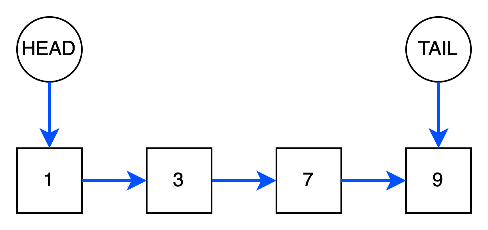
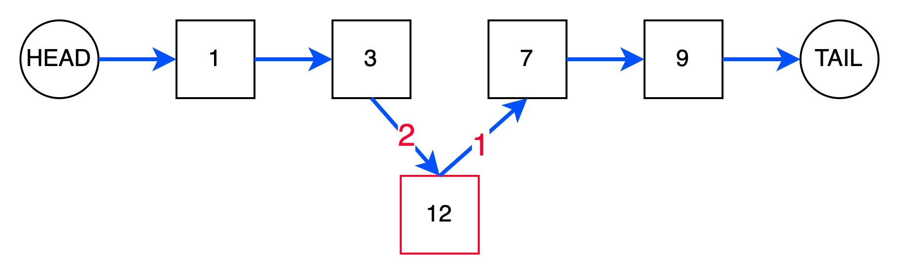
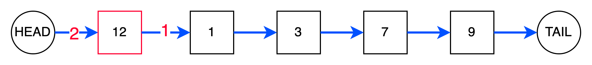
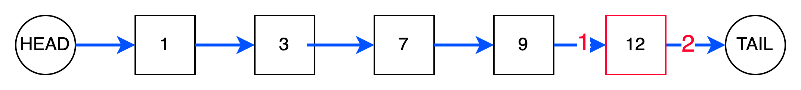
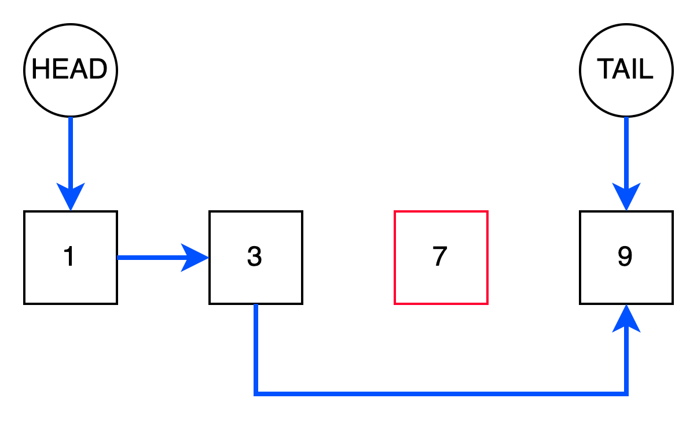
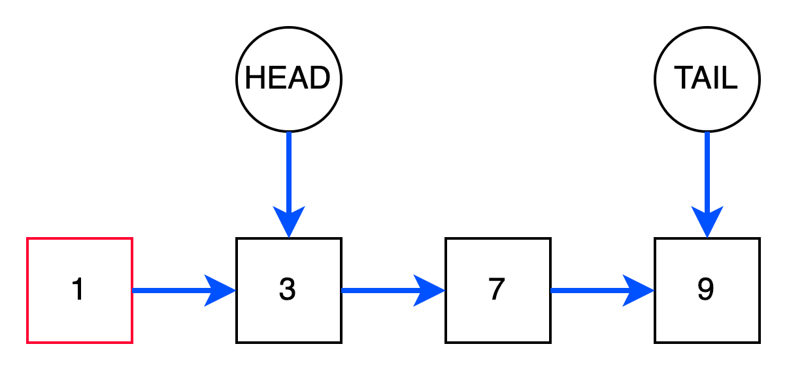
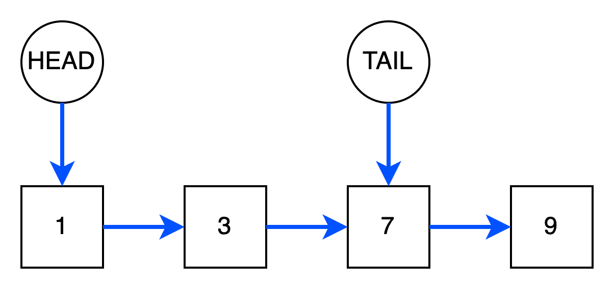

# Связанные списки

Связанный список - это линейная структуры данных, элементы в которой хранят ссылки на следующие объекты списка и
располагаются в разных фрагментах памяти. Различают односвязные и двусвязные списки.

## Односвязный список



На рисунке выше синяя стрелка отображает связь на следующий элемент. ``HEAD`` и ``TAIL`` -
указатели, хранящие ссылки на головной и конечный узлы.

Каждый узел в односвязном списке содержит не только значение, но и ссылку на следующий элемент. Программно его можно
представить так:

```python
class SinglyListNode:
    """
    Узел односвязного списка
    """
    def __init__(self, value, next_node):
        self.value = value
        self.next_node = next_node

```

Т.о. односвязный список можно однозначно определить головным указателем ``HEAD``. Заметим, что рассматриваемый список
имеет два указателя ``HEAD`` и ``TAIL`` на корневой ``head`` и конечный ``tail`` узлы соответственно. Если обращаться к
концу списка нам не нужно(например, удалять из конца списка), то указатель ``TAIL`` можем не хранить.

## Линейный поиск по односвязному списку

Линейный поиск по односвязному списку, как и по массиву, выполняется за линейное время. Чтобы найти заданное значение,
следует перебрать все элементы списка, начиная с головы, используя связи. Сложность данной операции оценивается в
**O(n)**.

## Доступ к элементу по индексу и присвоение значения по индексу

В отличие от массива, используя односвязный список, мы не можем получить доступ к элементу по индексу за константное
время. Чтобы получить i-ый элемент, мы должны пройтись по всем связям с первого узла до i-ого. Это имеет временную
сложность **O(n)**. Операция присвоения по индексу имеет аналогичную временную сложность.

## Вставка элемента в односвязный список

Чтобы вставить элемент в середину после заданного узла ``prev``, необходимо:



1. Инициализировать новый узел ``cur`` с заданным значением.
2. Связать ``cur`` с узлом ``next``, который следует после ``prev``.
3. Связать ``prev`` с узлом ``cur``.

В отличие от массива, мы не должны сдвигать все элементы в право для вставки. Мы просто инициализируем новый элемент и
переопределяем связи. Эта операция очень эффективна и имеет константную сложность **O(1)**. Заметим, что если для
вставки в середину задается следующий элемент ``next``, то для нахождения ``prev`` следует выполнить линейный поиск,
который занимает **O(n)**.

Чтобы вставить элемент в начало списка необходимо:



1. Инициализировать новый узел ``cur`` с заданным значением.
2. Связать ``cur`` с узлом ``head``, который в настоящий момент является головным.
3. Переназначить головной узел на ``cur``

Операция добавления в голову также занимает константное время.

Наконец последняя операция вставки - вставка в конец. Алгоритм данной операции следующий:



1. По указателю ``TAIL`` мы понимаем конечный элемент ``tail``.
2. Далее инициализируем новый узел ``cur`` с заданным значением.
3. Связываем конечный элемент ``tail`` с новым узлом ``cur``.
4. Переназначаем указатель ``TAIL`` на новый элемент ``cur``.

Операция добавления в хвост оценивается как **O(1)**. Заметим, что если список не хранит указатель ``TAIL`` на последний
элемент, то операция займет **O(n)**, т.к. пришлось бы сначала найти последний элемент.

Временная сложность операций:

Вставка элемента в середину - **O(1)**. При условии, что задается предыдущий элемент ``prev``, после которого следует
выполнить вставку.

Вставка элемента в "голову" - **O(1)**

Вставка элемента в "хвост" - **O(1)**. При условии, что список хранит указатель ``TAIL`` на последний элемент, иначе  
**O(n)**.

## Удаление элемента из односвязного списка

В данном случае удаление из середины займет линейное время. Порядок действий будет следующий:



1. Поиск предыдущего ``prev`` и следующего ``next`` элементов. Если на следующий элемент мы имеем ссылку и его поиск
   занимает константное время, то для нахождения предыдущего элемента потребуется выполнить линейный поиск начиная с
   головного узла.
2. Выполнить связывание предыдущего ``prev`` и следующего ``next`` элементов.

Т.к. операция поиска предыдущего ``prev`` элемента занимает линейное время, то и общая сложность операции оценивается
как **O(n)**.

Как упоминалось ранее, указатель ``HEAD`` определяет головной узел и, следовательно, весь список. Удаление элемента из
"головы" означает, что надо просто переназначить указатель ``HEAD`` на следующий ``next`` элемент.



Операция удаления элемента из "головы" оценивается как **O(1)** и является очень эффективной.

При удалении элемента из "хвоста" нам следует переместить указатель ``TAIL`` на элемент, который предшествует конечному
узлу.



Однако для определения предыдущего ``prev`` узла нам нужно выполнить линейный поиск начиная с головы, т.к. ссылки
на предыдущие узлы в односвязном списке не хранятся. Операция поиска записает линейное время, а следовательно общая
оценка сложности удаления из хвоста - **O(n)**.

Временная сложность операций:

Удаление элемента из "головы" - **O(1)**

Удаление элемента из середины - **O(n)**

Удаление элемента из "хвоста" - **O(n)**

