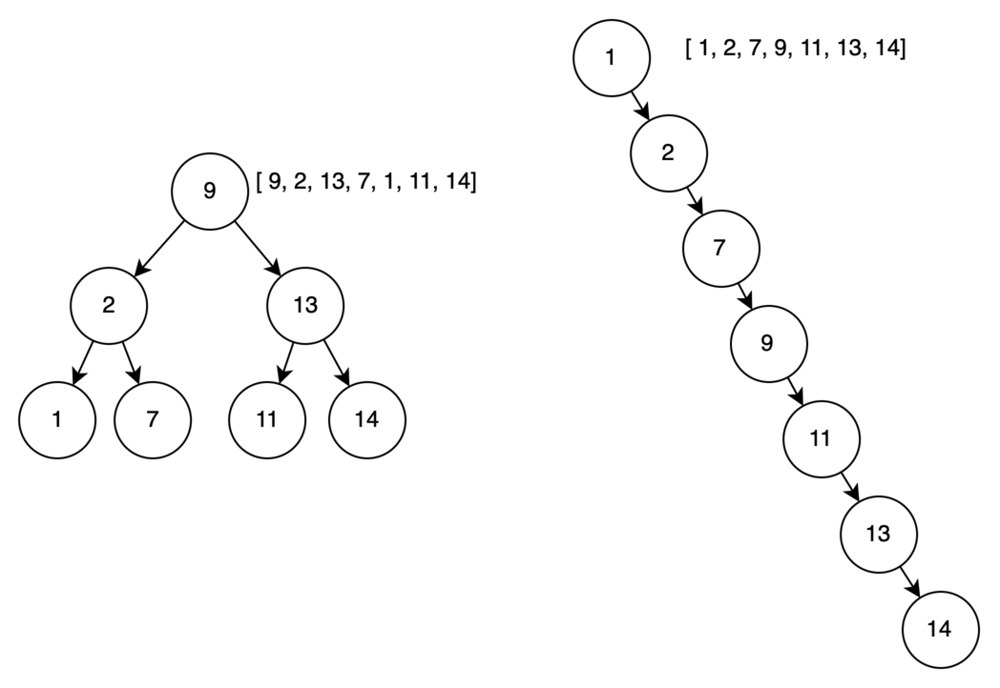

# Деревья

**Дерево** — это направленный граф без циклов между узлами. Каждый узел может иметь потомков и родителя. Узел без
родителя называется корнем дерева и является начальным. Вершины, у которых нет потомков, называются листьями.

Бинарное или двоичное дерево — это дерево, в котором у каждого узла может быть не более двух потомков.

Бинарное дерево **поиска** — это бинарное дерево, в котором в левом поддереве значения меньше, чем само значение
родителя, а в правом поддереве значения должны быть больше. В случае если дерево сбалансировано, его высота ``К`` будет
равна **O(logN)**.

Важно заметить, что если при построении дерева ключи ее узлов идут в случайном порядке, то такие деревья называют
**сбалансированными**. Такие рандомизированные деревья поиска обеспечивают сбалансированность только в вероятностном
смысле. Они обладают следующими свойствами:

1. имеют небольшую высоту  
1. имеют хорошую заполненность уровней

На рисунке ниже слева приведен пример сбалансированного дерева, которое получается для
ключей ``[ 9, 2, 13, 7, 1, 11, 14]``. Справа изображено **несбалансированное дерево** для упорядоченных
значений ``[ 1, 2, 7, 9, 11, 13, 14]``, вырожденное в односвязный список.



Существует несколько методов балансировки деревьев. Рассмотрим их чуть позже, а сейчас перейдем к основным операциям,
связанных с деревьями.

## Основные операции с деревьями

### Поиск в дереве

В общем случае, двоичное дерево является графом, поэтому к нему применимы операции обхода в ширину и глубину о котором
можно почитать по ссылкам ниже.

[Обход графа в ширину](bfs.md)

[Обход графа глубину](dfs.md)

Однако для поиска значений узлов наиболее эффективнее было бы использовать свойство двоичных деревьев, что для любого
ключа его левое поддерево содержит только меньшие ключи, а правое — только большие. Ниже представлена функция для поиска
ключа в бинарном дереве.

```python
from typing import Optional


class TreeNode:
    def __init__(self, val=0, left=None, right=None):
        self.val = val
        self.left = left
        self.right = right

    def __repr__(self):
        return str(self.val)


def search_bst(node: Optional[TreeNode], val: int) -> Optional[TreeNode]:
    """
    Поиск ключа в бинарном дереве
    :param node: узле
    :param val: искомое значение
    :return: найденный узел, None если не найдено
    """
    if not node:
        return None

    if node.val == val:
        return node

    if node.val > val:
        return search_bst(node.left, val)

    if node.val < val:
        return search_bst(node.right, val)
```

### Добавление элемента

Добавление элемента происходит по следующим правилам:

1. Происходит поиск добавляемого ключа. Если добавляемое значение уже присутствует в дереве, то оно игнорируется. В
   противном случае поиск приводит нас в конечному листу дерева с каким-то значением ``A``.
1. Если добавляемое значение меньше значения ``A`` в текущем узле, то новая вершина становится левым потомком, иначе –
   правым.

### Удаление элемента

Удаление элемента является наиболее сложной операцией с точки зрения реализации. Возможны 3 варианта действий:

**Узел является листом**, т.е. не имеет потомков. Тогда мы можем просто его удалить.

**Вершина имеет только одного ребенка.** В этом случае мы удаляем саму вершину, а ее дочернее поддерево подвешиваем к
родителю.

**Если у узла два дочерних узла**, то нужно найти следующий за ним элемент, т.е. минимум в правом поддереве (у этого
элемента не будет левого потомка). Правого потомка подвесить на место найденного элемента, а удаляемый узел заменить
найденным узлом.

### Нахождение максимума и минимума

Нетрудно заметить, что на рисунке выше у дерева слева максимальным элементом является значение 14. Это **самый правый
элемент**, который не имеет правого ребенка (при этом левое поддерево может существовать). Аналогично, минимальным
элементом дерева является значение 1. Это **самый левый элемент**, который не имеет левого ребенка.

### Временная сложность операций

Время работы всех перечисленных операций зависит от высоты дерева ``К``, т.е. равно **O(logN)** в случае
сбалансированности.

## Методы балансировки деревьев

Итак, сложность всех операций с деревом зависит от его высоты. Следовательно, для эффективной работы нам нужно стараться
минимизировать его высоту. Эта операция называется балансировкой. Кратко рассмотрим некоторые виды оптимизации деревьев.

### АВЛ-деревья

АВЛ-дерево — сбалансированное двоичное дерево поиска, в котором поддерживается следующее свойство: для каждой его
вершины высота её двух поддеревьев различается не более чем на 1. В процессе добавления и удаления узлов высота дочерних
поддеревьев некоторых узлов может стать больше 2 или -2. Тогда следует провести ребалансировку дерева путем левого или
правого поворота.

Подробнее [здесь](https://neerc.ifmo.ru/wiki/index.php?title=%D0%90%D0%92%D0%9B-%D0%B4%D0%B5%D1%80%D0%B5%D0%B2%D0%BE)
и [здесь](https://habr.com/ru/articles/150732/)

### Красно-черное дерево

Красно-чёрным называется бинарное дерево, у которого каждому узлу сопоставлен дополнительный аттрибут – цвет, а также
выполняются следующие свойства:

1. Каждый узел промаркирован красным или чёрным цветом
2. Корень и конечные узлы (листья) дерева – чёрные
3. У красного узла родительский узел – чёрный
4. Все простые пути из любого узла x до листьев содержат одинаковое количество чёрных узлов – black-height(x)
5. Чёрный узел может иметь чёрного родителя

Подробнее [здесь](https://neerc.ifmo.ru/wiki/index.php?title=%D0%9A%D1%80%D0%B0%D1%81%D0%BD%D0%BE-%D1%87%D0%B5%D1%80%D0%BD%D0%BE%D0%B5_%D0%B4%D0%B5%D1%80%D0%B5%D0%B2%D0%BE)
