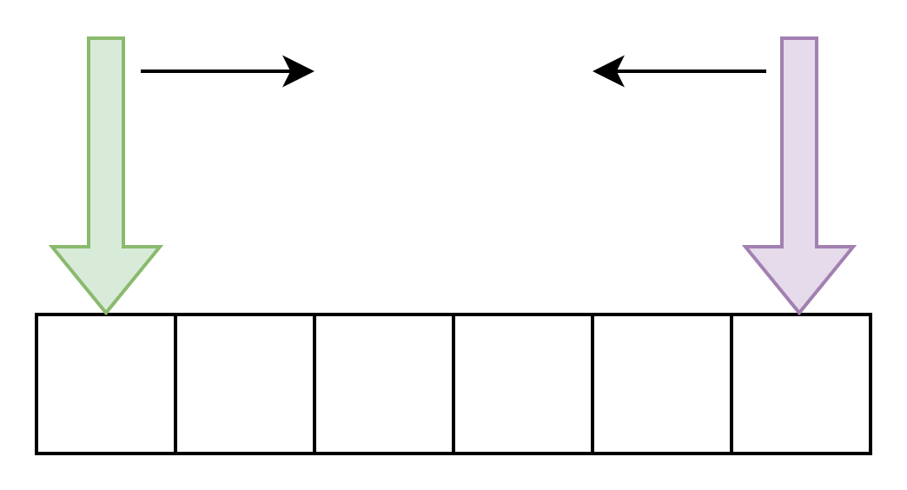
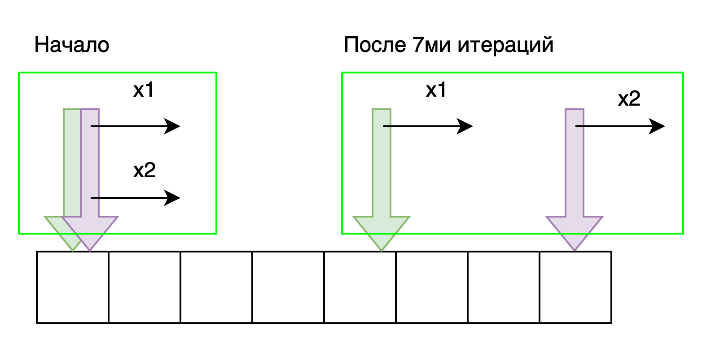

# Метод двух указателей (Two-pointer Technique)

Обычно в задачах итерации или поиску по списку мы имеем один указатель, который итерируется с первого до последнего
элемента коллекции. Однако иногда полезно иметь два указателя, которые можно использовать так:



1. В начальный момент времени указатели установлены на разные элемента списка. Обычно первый указывает на его начало, а
   второй на конец. Далее происходит итерация указателей к середине списка, где встретившись, они завершают свою работу.
   Этот прием часто используют в отсортированном массиве или списке. Примером, где возможно использование данного
   алгоритма может служить задача перестановки элементов списка задом наперед без дополнительного выделения памяти.

```python
def reverse_arr(arr: List[int]) -> list:
    i = 0
    j = len(arr) - 1
    while i < j:
        arr[i], arr[j] = arr[j], arr[i]
        i += 1
        j -= 1

    return arr
```

Этот сценарий хорошо работаем в массиве или в двусвязном списке, но мы не можем его использовать в односвязном списке,
т.к. проход по нему происходит в одном направлении.



2. Второй сценарий использования двух указателей, это когда в начальный момент времени они указывают на один элемент
   списка, проход по списку происходит в одном направлении, но указатели двигаются с разной скоростью - один быстрее
   другого. Данный алгоритм мы можем применить как в массиве или в двусвязном списке, так и в односвязном списке. Обычно
   можно принять, что за один шаг "медленного" указателя "быстрый" делает два шага. В тех задачах, где требуется
   определить стратегию движения указателей можно использовать данный алгоритм. Обычно это задачи с ограничением по
   памяти типа "замены на месте". Например, быстрый указатель служит для итерации по последовательности, а более
   медленный указывает на позицию для нового добавления элемента

```python
def test_remove_element():
    nums = [0, 1, 2, 2, 3, 0, 4, 2]
    assert 5 == remove_element(nums, 2)
    print(nums[:5])  # [0, 1, 3, 0, 4]


def remove_element(arr: List[int], val: int):
    """
    Выполняет удаление значение из массива "на месте"
    :param arr: данный массив
    :param val: значение, которое следует удалить
    :return: длинна массива с актуальными значениями
    """
    j = 0  # j is slow runner
    for i in range(len(arr)):  # i is fast runner
        if arr[i] != val:
            arr[j] = arr[i]
            j += 1
    return j
```

Как упоминалось выше, метод двух указателей можно использовать в связных списках. Однако следует учитывать некоторые
особенности:

1. Перед вызовом ``node.next`` следует всегда проверять, что узел ``node`` не нулевой, иначе программа вызовет
   исключение.
2. Следует правильно выбрать условие окончания прохода по списку.

Рассмотрим задачу, где учитываются эти особенности.

Оригинал: [141. Linked List Cycle](https://leetcode.com/problems/linked-list-cycle/description/)

```python
def test_has_cycle():
    list_1 = create_list_from_array([3, 2, 0, -4], 1)

    assert has_cycle(list_1)


def has_cycle(head: Optional[ListNode]) -> bool:
    if not head:
        return False

    first_pointer = head
    second_pointer = head

    while True:
        # move slow pointer one step each time
        first_pointer = first_pointer.next
        # move fast pointer two steps each time
        second_pointer = second_pointer.next
        if not second_pointer:
            break
        second_pointer = second_pointer.next
        if not second_pointer:
            break

        # change this condition to fit specific problem
        if id(first_pointer) == id(second_pointer):
            return True

    return False
```